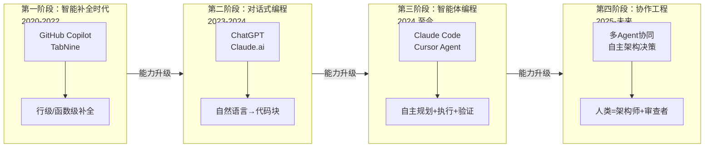

# AI Coding 零基础实战教程

## 第一部分：AI编程基础理论

> **学习目标**：建立对AI辅助编程的系统认知，理解核心概念与方法论
>
> **完成标志**：能向他人清晰解释什么是 Vibe Coding、Agentic Engineering 和 SDD

在正式上手工具之前，我们需要先建立"认知地图"。这就像学开车之前要先了解交通规则一样 —— 你不需要成为交通工程师，但至少要知道红灯停绿灯行、靠右行驶这些基本概念。

### 1.1 AI辅助编程全景认知

#### 1.1.1 什么是AI辅助编程

**传统编程**是你一行一行地"手写"代码，告诉计算机每一步该怎么做。你需要掌握编程语言的语法、理解算法、记住各种API —— 学习曲线陡峭且耗时漫长。

**AI辅助编程**则完全不同。你用自然语言（中文或英文都行）描述"你想要什么"，AI帮你把它变成可运行的代码。你的角色从"打字员"变成了"指挥官"。

| 维度 | 传统编程 | AI辅助编程 |
|------|---------|-----------|
| 核心技能 | 编程语言语法、算法 | 需求描述、意图表达、结果验证 |
| 人的角色 | 代码编写者 | 需求定义者 + 结果审查者 |
| 关注点 | "怎么做"（How） | "做什么"和"为什么"（What & Why） |
| 学习周期 | 数月到数年 | 数天到数周 |
| 出错时 | 自己调试代码 | 用自然语言告诉AI去修复 |

打个比方：传统编程就像你自己从头学做一道红烧肉 —— 要学买菜、备料、掌握火候；AI编程就像你请了一个专业厨师 —— 你只需要说"我想吃红烧肉，少放糖，多放一点八角"，厨师帮你做出来，你尝一口觉得太咸了，再说"减少一些盐"就行。

> **提示**：AI编程不是"不需要懂任何技术"，而是大幅降低了入门门槛。随着你的使用越来越深入，你会自然而然地积累技术知识。这个过程是"边用边学"，而非传统的"先学后用"。

#### 1.1.2 AI编程的发展历程

AI编程并不是突然出现的，它经历了一个清晰的演进过程：

**第一阶段：智能补全时代（2020-2022）**

代表产品：GitHub Copilot、TabNine

就像手机输入法的联想功能 —— 你打了几个字，它猜你接下来要打什么。这个阶段的AI只能帮你补全一行或几行代码，依然需要你自己动手写大部分代码。

**第二阶段：对话式编程时代（2023-2024）**

代表产品：ChatGPT、Claude.ai

AI进化成了一个"编程顾问"。你可以用自然语言问它"怎么写一个排序算法"，它会给你一段完整的代码。但问题是：你需要自己把代码复制到项目中、自己处理各种细节，AI并不了解你的项目全貌。

**第三阶段：智能体编程时代（2024 至今）** ← 我们现在就在这里

代表产品：Claude Code、Cursor Agent、Qoder、Codex

这是一个质的飞跃！AI从"回答问题"进化到了"完成任务"。你告诉它"给我的项目添加一个用户登录功能"，它会**自己**去读你的项目代码，**自己**创建需要的文件，**自己**写代码，**自己**运行测试 —— 全程自主完成。

这就像从"问路人"（对话式）变成了"请了一个代驾"（智能体）—— 你只需要说目的地，它自己开车到。

**第四阶段：协作工程时代（正在形成）**

多个AI智能体组成"团队"，各司其职 —— 一个负责设计架构、一个负责写代码、一个负责测试、一个负责审查代码质量。人类的角色进一步上升为"项目总监"。

```
第一阶段       第二阶段        第三阶段         第四阶段
AI帮你打字  →  AI帮你想方案  →  AI帮你做任务  →  AI团队帮你做项目
（补全）      （对话）        （智能体）       （多智能体协作）
```


*图：AI编程四个发展阶段演进示意图*

#### 1.1.3 AI是如何"理解"和"生成"代码的

你不需要成为AI专家，但理解以下几个核心概念会帮你更好地使用AI工具：

**Token化：AI怎么"阅读"代码**

AI不是像人一样一个字一个字地读代码，它把文本切成一个个小块，叫做 **Token**。

例如，`Hello World` 会被切成 `Hello` 和 ` World` 两个 Token。中文的 `你好世界` 可能被切成 `你好` 和 `世界` 两个 Token，也可能被切成更多个。

为什么这个概念重要？因为**AI的计费和能力限制都以 Token 为单位**。你发送的内容越长，消耗的 Token 越多，费用越高。

> **提示**：简单记住这个换算关系 —— 1 个 Token ≈ 4 个英文字符 ≈ 1-2 个中文字符。一篇 1000 字的中文文章大约是 500-1000 个 Token。

**上下文窗口：AI的"工作记忆"**

上下文窗口是AI一次能"记住"的内容量。这就像你的办公桌大小 —— 桌子越大，能同时摊开的文件越多。

| 模型 | 上下文窗口 | 相当于 |
|------|-----------|--------|
| 早期模型 | 4K Token | 一篇短文 |
| GPT-5.x / GPT-4o 系列 | 128K+ Token | 一本小说到一套资料 |
| Claude Sonnet / Opus | 200K-1M Token | 一本厚书到一套资料 |
| Gemini Pro 系列 | 1M Token 级别 | 一个小型图书馆 |

对于AI编程来说，上下文窗口越大越好 —— 因为AI需要同时"看到"更多项目代码才能做出合理的修改。Claude、Gemini、GPT 等主流模型都在持续扩大上下文窗口。

**概率生成：为什么AI有时会"胡说八道"**

AI生成内容的本质是**预测概率最高的下一个词**。大多数时候它预测得很准，但有时候它会"一本正经地胡说八道" —— 这被称为**"幻觉"（Hallucination）**。

例如，AI可能信心满满地告诉你某个函数的用法，但这个函数根本不存在。这就像一个知识渊博但偶尔会编故事的朋友 —— 大部分时候值得信赖，但关键信息你需要自己验证。

>  **避坑**：永远不要100%信任AI生成的代码。尤其是涉及数据库操作、用户认证、支付逻辑等关键代码时，一定要仔细检查。"信任但验证"是AI编程的黄金法则。

#### 1.1.4 Vibe Coding：感觉驱动的编程新范式

**Vibe Coding** 是 AI 大牛 Andrej Karpathy（前OpenAI/Tesla AI主管）在2025年初提出的概念。他的原话是：

> "完全沉浸在氛围中，拥抱指数级增长，忘记代码的存在。"

翻译成大白话就是：**不要纠结代码的每一个细节，跟着感觉走，让AI帮你实现想法**。

Vibe Coding 的核心原则：

1. **意图优先**：先描述你想要什么效果，而不是告诉AI怎么写代码
2. **快速迭代**：不追求一次完美，拥抱"生成 → 测试 → 修正"的循环
3. **信任但验证**：相信AI的能力，但始终检查关键逻辑
4. **上下文经营**：持续维护和优化提供给AI的背景信息

**Vibe Coding 适用场景：**

-  原型开发、概念验证（快速把想法变成可运行的东西）
-  个人项目、学习项目（试错成本低）
-  探索性编程（不确定最终效果，边做边看）
-  UI/前端开发（可视化反馈快，容易判断好不好）

**Vibe Coding 需谨慎的场景：**
- 注意： 生产环境的核心系统（银行、医疗等）
- 注意： 安全敏感代码（认证、加密等）
- 注意： 性能极致要求的场景

> **提示**：Vibe Coding 不等于"乱来"。它的精髓在于**改变你的关注点** —— 从关注"代码怎么写"转向关注"产品好不好用"。

---

### 1.2 Agentic Engineering：工程化升级范式

#### 1.2.1 为什么纯 Vibe Coding 在大项目中不够用

Vibe Coding 对于做小项目、快速原型非常好用，但当项目变大变复杂时，纯粹的"跟着感觉走"会遇到麻烦：

- **代码质量不可控**：AI可能写出能跑但很乱的代码，积累成"技术债务"
- **前后矛盾**：AI在不同对话中可能给出相互冲突的实现方式
- **缺乏全局视角**：AI可能只关注当前的小任务，忽略对整体架构的影响
- **难以协作**：没有统一规范时，多个人（或多次会话）的代码风格各异

这就像建房子 —— 自己搭一个小木屋可以随意发挥（Vibe Coding），但要建一栋大楼就必须有图纸、有规范、有质检（Agentic Engineering）。

#### 1.2.2 什么是智能体（Agent）

在AI编程的语境中，**智能体（Agent）**是一个能够**自主完成任务**的AI系统。它和普通的AI聊天有什么区别？

| 维度 | 普通AI聊天 | 智能体（Agent） |
|------|-----------|----------------|
| 行为 | 你问一句，它答一句 | 你说一个目标，它自己规划并执行多个步骤 |
| 能力 | 只能生成文字 | 能读写文件、运行命令、搜索代码、调用工具 |
| 主动性 | 被动回答 | 主动规划、主动发现问题 |
| 记忆 | 仅限当前对话 | 可以有长期记忆 |
| 比喻 | 百科全书 | 实习生程序员 |

一个智能体的工作循环是 **感知 → 推理 → 行动 → 反馈**：

```
   ┌─────────────────────────────────┐
   │                         │
   ▼                         │
  感知（读取项目代码、理解需求）      │
   │                         │
   ▼                         │
  推理（分析问题、制定计划）         │
   │                         │
   ▼                         │
  行动（修改文件、运行命令、安装依赖）   │
   │                         │
   ▼                         │
  反馈（检查结果、发现新问题）──────────┘
```

Claude Code 就是一个典型的编程智能体 —— 你告诉它"帮我添加一个用户注册功能"，它会自己读懂项目代码，自己创建文件，自己写代码并运行测试。

#### 1.2.3 智能体协作模式

当一个智能体不够用时（比如项目特别复杂），可以让多个智能体协作，各司其职。就像一个公司不是一个人干所有事 —— 有产品经理、有程序员、有测试员、有设计师。

**领导者-执行者模式（Leader-Worker）**

一个"老板"Agent负责拆分任务和协调，多个"员工"Agent负责执行具体任务。

```
               ┌──────────┐
               │ 领导Agent │ ← 你的需求
               │（规划分配）│
               └──┬───┬───┘
                  │   │
           ┌────────┘   └────────┐
           ▼                ▼
      ┌──────────┐        ┌──────────┐
      │编码Agent  │        │测试Agent  │
      │（写代码）  │        │（写测试）  │
      └──────────┘        └──────────┘
```

Qoder 就是这种模式的典型代表 —— 有 Leader（指挥官）、Coding（开发者）、Research（研究员）、Verify（测试员）等多个 Agent 角色。

**管道式协作（Pipeline）**

Agent按顺序接力，就像工厂流水线：

```
需求分析Agent → 架构设计Agent → 代码实现Agent → 测试Agent → 部署Agent
```

**对等协作（Peer-to-Peer）**

多个Agent平等地互相审查，就像同事之间互相Code Review。

> **提示**：对于初学者来说，你暂时只需要了解这些概念。在实际使用中，Claude Code 是一个单智能体工具（一个Agent帮你做所有事），已经能完成大多数项目。当项目足够复杂时，再考虑 Qoder 等多智能体方案。

#### 1.2.4 自主决策与任务分解

优秀的AI编程智能体不会一股脑地把所有代码写出来，它会像一个经验丰富的程序员一样，先思考再行动：

**Plan-Act-Observe-Reflect 循环：**

```
1. Plan（规划）：   "要完成登录功能，我需要做这些事......"
2. Act（行动）：   "先创建数据库用户表......"
3. Observe（观察）："创建成功了，但发现少了一个字段......"
4. Reflect（反思）："我需要修改表结构，加上邮箱字段......"
5. 回到 Plan：     "好的，现在继续下一步......"
```

**任务分解原则 —— MECE：**

MECE（Mutually Exclusive, Collectively Exhaustive）是一个管理咨询中常用的概念，意思是"相互独立，完全穷尽"。

举个例子，把"构建一个博客系统"分解为：

```
构建博客系统
├── 1. 用户系统（注册、登录、个人资料）
├── 2. 文章系统（创建、编辑、删除、列表）
├── 3. 评论系统（发表、删除、回复）
├── 4. 分类标签（创建分类、打标签、按分类筛选）
└── 5. 部署上线（打包、配置服务器、域名）
```

这5个子任务之间互不重叠（相互独立），合在一起覆盖了博客系统的全部功能（完全穷尽）。

> **提示**：在使用 Claude Code 时，最佳实践是**先让AI制定计划，你确认后再执行**。而不是一上来就让它开始写代码。这个习惯会大幅减少返工。

---

### 1.3 规范驱动开发 SDD（Specification-Driven Development）

#### 1.3.1 为什么AI编程需要"规范"

你有没有过这种经历：在淘宝买衣服时，你描述"我要一件好看的衣服"，结果收到的和你想的完全不一样？这就是**沟通不精准**导致的。

AI编程也是一样。如果你告诉AI"帮我做一个网站"，它可能做出一个和你期望完全不同的东西。"垃圾进，垃圾出" —— 模糊的需求必然导致不准确的结果。

**规范（Specification）就是你和AI之间的"合同"**，它明确地写清楚：

- 要做什么（功能需求） 
- 怎么做（技术方案）
- 做到什么程度（质量标准）

有了这份"合同"，AI才能精准地理解你的意图。

#### 1.3.2 需求规范：PRD文档

**PRD（Product Requirements Document，产品需求文档）**描述的是"要做什么"。

**用户故事（User Story）格式：**

```
作为一个 [角色]，
我希望 [功能]，
以便 [价值/目的]。
```

例如：
```
作为一个博客读者，
我希望能按标签筛选文章，
以便快速找到我感兴趣的内容。
```

**验收标准（Acceptance Criteria）格式：**

```
Given（前提条件）：系统中有20篇文章，其中5篇标记了"Python"标签
When（操作）：用户点击"Python"标签
Then（预期结果）：页面只显示这5篇标记了"Python"标签的文章
```

**用AI辅助生成PRD的Prompt：**

这是一个非常实用的技巧 —— 你可以让AI帮你把模糊的想法变成结构化的需求文档：

```
我想做一个个人书签管理工具。

请帮我生成一份完整的PRD文档，包含：
1. 项目概述（一句话描述）
2. 目标用户
3. 核心功能列表（按优先级排列：Must Have / Should Have / Nice to Have）
4. 每个功能的用户故事和验收标准
5. 非功能需求（性能、安全、兼容性）

请用Markdown格式输出。
```

> **提示**：在第五部分的项目实操中，我们会完整演示如何用这个方法生成PRD文档。

#### 1.3.3 技术规范：SPEC文档

**SPEC（Technical Specification，技术规范文档）**描述的是"怎么做"。

一个完整的SPEC文档包含：

| 模块 | 内容 | 说明 |
|------|------|------|
| 系统架构 | 整体架构设计图 | 前后端如何交互 |
| 技术选型 | 使用什么技术和框架 | 比如 Next.js + Prisma + SQLite |
| 数据模型 | 数据库表结构设计 | 有哪些表、每个表有哪些字段 |
| API接口 | 接口定义 | 每个API的URL、请求参数、返回格式 |
| 目录结构 | 项目文件组织 | 代码放在哪个文件夹 |

**让AI从PRD自动生成SPEC的Prompt：**

```
基于以下PRD文档，请生成对应的技术规范文档（SPEC）：

[粘贴你的PRD内容]

要求：
1. 推荐技术选型并说明理由
2. 设计完整的数据模型（包含字段类型和关系）
3. 列出所有API接口（RESTful风格）
4. 给出建议的项目目录结构
```

#### 1.3.4 质量规范

质量规范定义了"做到什么程度算合格"：

- **编码规范**：代码风格统一、命名规则、注释要求
- **测试规范**：需要覆盖哪些测试场景
- **安全规范**：输入验证、认证授权、数据保护

> **提示**：对于初学者来说，不需要一开始就写完美的规范文档。从简单的PRD开始，随着项目变复杂再逐步完善。规范的核心价值在于 —— **让你和AI的沟通更精准**。

#### 1.3.5 规范文件的组织与管理

建议在项目根目录下创建一个 `specs/` 文件夹，统一管理规范文件：

```
my-project/
├── specs/
│   ├── PRD.md         # 产品需求文档
│   ├── SPEC.md         # 技术规范
│   ├── ARCHITECTURE.md   # 架构设计
│   └── API.md         # API 接口文档
├── src/              # 源代码
├── CLAUDE.md          # 给Claude Code的项目说明（详见第二部分）
└── package.json
```

规范文件最大的价值之一是 —— **可以直接作为AI工具的上下文输入**。当你把 SPEC.md 的内容提供给 Claude Code 时，它就能精准地按照你的技术方案来写代码。

---

### 1.4 主流模型系列介绍

#### 1.4.1 大语言模型基础知识

**参数量：模型的"大脑"大小**

你可能听说过"7B模型"、"70B模型"这样的说法。这里的 B 是 Billion（十亿）的缩写，指的是模型的参数数量。简单理解：参数越多，模型越"聪明"，但也越慢、越贵。

| 参数量级 | 能力                 | 类比   |
| -------- | -------------------- | ------ |
| 1-7B     | 基础对话、简单代码   | 小学生 |
| 7-30B    | 较好的编程、推理能力 | 中学生 |
| 30-70B   | 优秀的编程、复杂推理 | 大学生 |
| 70B+     | 顶级的编程、深度推理 | 研究生 |

> **提示**：参数量不是唯一标准。训练数据的质量、训练方法的优化同样重要。有些小参数模型经过精细调优后，在特定任务上可以媲美大模型。

**上下文窗口：再次强调的核心概念**

对AI编程来说，上下文窗口直接决定了AI能"看到"你项目中多少代码。窗口越大，AI对项目的理解越全面，生成的代码越准确。

```
4K Token   ≈ 一个文件      → 只能看到当前文件
32K Token  ≈ 几个文件      → 能看到相关的几个文件
128K Token ≈ 一个小项目    → 能理解整个小项目
200K Token ≈ 一个中型项目   → 许多主力模型的长上下文起点
1M Token   ≈ 一个大型项目   → Claude / Gemini / GPT 等旗舰模型的超长上下文级别
```

**Token 计费：你的"油费"**

使用AI模型就像开车需要加油 —— Token 就是你的"油"，用多少付多少。

```
费用 = 输入Token数 × 输入单价 + 输出Token数 × 输出单价
```

**Temperature：AI的"创造性开关"**

Temperature 是一个 0-1 之间的参数，控制AI回复的"随机性"：

- **Temperature = 0**：每次给出几乎相同的答案（最确定性）→ 适合代码生成
- **Temperature = 1**：每次答案都不同（最随机）→ 适合创意写作

> **提示**：编写代码时，通常不需要手动调整 Temperature。Claude Code 默认使用适合编程的低 Temperature 值。

#### 1.4.2 Claude 系列（Anthropic）

Claude 是本教程推荐的主力模型，由 Anthropic 公司开发。

| 模型          | 上下文 | 速度 | 代码能力 | 推理能力 | 费用档位 | 关键特点                 |
| ------------- | ------ | ---- | -------- | -------- | -------- | ------------------------ |
| Claude Haiku 4.5  | 200K   | 极快 | 良好     | 中等     | $        | 轻量任务、批处理、低成本 |
| Claude Sonnet 4.6 | 1M | 快 | 优秀 | 强 | $$ | **日常开发主力，性价比高** |
| Claude Opus 4.7   | 1M   | 中等 | 顶级     | 极强     | $$$     | 复杂规划、架构和疑难问题 |

**核心优势：**

- 超长上下文（200K 到 1M，随模型不同而变化），项目级代码理解能力强
- 代码生成质量在业界领先
- 指令遵循能力精确（你说什么，它就做什么）
- 安全对齐好（不容易生成危险代码）

#### 1.4.3 GPT 系列（OpenAI）

| 模型         | 定位   | 特点         | 适用场景            |
| ------------ | -------- | ------------ | ------------------- |
| GPT-5.5      | 最新旗舰 | 推理、编程、多模态综合能力最强 | 复杂开发、架构设计、疑难调试 |
| GPT-5.x mini / nano | 轻量模型 | 速度快、成本低 | 简单任务、批量处理 |
| o 系列推理模型 | 深度推理 | 强化数学、算法、复杂推理 | 算法题、复杂约束问题 |

**核心优势**：多模态能力强、工具调用生态成熟，和 Codex / ChatGPT / OpenAI API 的集成最完整。

**适合场景**：将UI截图转换为代码、需要视觉理解的任务。

#### 1.4.4 GLM 系列（智谱AI）

智谱AI的GLM系列（配套 CodeGeex 代码助手），中文能力和代码能力均衡，国内可用。

| 模型            | 特点                                 | 在 cc 中的角色                                    |
| --------------- | ------------------------------------ | ------------------------------------------------- |
| **GLM-4.7**     | 智谱当前默认主力模型，代码与推理均衡 | 默认占用 Opus / Sonnet 槽位                       |
| **GLM-4.5-Air** | 轻量、高速                           | 默认占用 Haiku 槽位                               |
| **GLM-5.1**     | 高阶推理模型，能力更强               | **需手动覆盖**三个槽位才会启用，高峰期算 3 倍消耗 |

#### 1.4.5 DeepSeek 系列 国内推荐

| 模型                  | 特点                                    | 适用场景                           |
| --------------------- | --------------------------------------- | ---------------------------------- |
| **deepseek-v4-pro[1m]** | DeepSeek 官方 Claude Code 接入示例使用的主力模型 | 通过 Anthropic 兼容端点接入 Claude Code |
| **deepseek-v4-flash**   | 轻量高速模型 | 适合 Haiku / Subagent 等轻量槽位 |

> 注意： 模型名与后续变化请以 [DeepSeek 官方文档](https://api-docs.deepseek.com/zh-cn/quick_start/agent_integrations/claude_code) 为准。

**核心优势**：

- **极致性价比**：价格远低于官方 Claude
- 代码能力强，接近 Claude Sonnet 水平
- 国内直连，注册简单
- 官方为 Claude Code 提供了专用的 **Anthropic 兼容端点**，适配度高

#### 1.4.6 通义千问系列（阿里云）

| 模型       | 特点               | 适用场景           |
| ---------- | ------------------ | ------------------ |
| Qwen-Plus / Qwen-Max | 均衡性能、中文优化 | 中文项目的日常开发 |
| Qwen3-Coder / Qwen-Coder 系列 | 代码专精 | 纯编程任务、代码生成 |

**核心优势**：中文理解能力出色、国内直连、阿里云生态集成。

#### 1.4.7 其他值得关注的模型

| 模型       | 开发者     | 特点                      | 场景              |
| ---------- | ---------- | ------------------------- | ----------------- |
| Gemini Pro 系列 | Google     | 超大上下文、多模态   | 超长代码库分析    |
| Kimi / Moonshot 系列 | 月之暗面   | 长上下文、中文好 | 中文长文档处理    |
| Llama 系列    | Meta       | 开源旗舰、可本地部署      | 离线/隐私敏感场景 |
| Mistral 系列  | Mistral AI | 欧洲开源、代码能力强      | 本地部署替代方案  |

---

#### 1.4.8 模型选型实战指南

##### 1.4.8.1 选型决策树

面对一个编程任务时，按以下流程选择模型：

```
你的任务是什么？
│
├── 简单任务（代码补全、格式化、小修改）
│   ├── 追求最快速度 → Claude Haiku / GLM-4.5-Air / 本地 Qwen
│   ├── 追求最低成本 → DeepSeek API / 本地 Ollama
│   └── 完全免费 → 本地 Ollama 模型
│
├── 日常开发（功能实现、Bug修复、代码生成）
│   ├── 英文项目 → Claude Sonnet （首选）
│   ├── 中文项目 → Claude Sonnet 或 通义千问 / GLM-4.7
│   └── 预算紧张 → DeepSeek V4 / GLM / Kimi
│
├── 复杂任务（架构设计、算法难题、疑难Bug）
│   ├── 深度推理 → Claude Opus / GPT-5.5 / DeepSeek V4 Pro
│   └── 超长代码库 → Gemini Pro (1M上下文)
│
└── 特殊场景
   ├── 离线/隐私要求 → 本地 Ollama + Llama/Qwen
   ├── 截图→代码 → GPT-5.5 / GPT-4o 系列（多模态）
   └── 国内直连要求 → DeepSeek / 千问 / GLM
```

##### 1.4.8.2 成本优化策略

**策略一：分层使用**

```
简单任务 ──→ Haiku / GLM-4.5-Air / 本地 Qwen（成本：$）
日常任务 ──→ Sonnet / DeepSeek V4 Pro      （成本：$$）
复杂任务 ──→ Opus / GLM-5.1              （成本：$$$$）
```

不要所有任务都用最贵的模型，就像不是每次出门都需要打专车。

**策略二：Prompt Cache（缓存利用）**

Claude 和 GPT 都支持 Prompt Cache —— 如果你发送的上下文中有大量重复内容（如每次都发送同一个 CLAUDE.md），后续请求可以复用缓存，显著降低重复上下文的输入成本。

**策略三：本地模型补充**

对于简单的代码格式化、注释生成等任务，可以使用 Ollama 部署的本地模型，完全免费。

**一个月的费用预估：**

| 使用强度            | 推荐模型                         | 月费用估算             |
| ------------------- | -------------------------------- | ---------------------- |
| 轻度（每天1-2小时） | DeepSeek API / GLM / Kimi        | ¥5-30（视模型与套餐）  |
| 轻度                | Claude Sonnet                    | $10-30（约¥70-210）    |
| 中度（每天3-5小时） | Claude Sonnet                    | $30-80（约¥210-560）   |
| 重度（全天使用）    | Claude Sonnet + Haiku            | $80-200（约¥560-1400） |

#### 1.4.9 安全与隐私考量

| 方案                    | 数据隐私             | 适用场景                 |
| ----------------------- | -------------------- | ------------------------ |
| 云端API（Claude/GPT等） | 数据经过服务商服务器 | 一般项目、学习项目       |
| 本地部署（Ollama）      | 数据不出本机         | 企业敏感代码、隐私要求高 |

> **注意**：使用云端AI服务时，你发送的代码会经过服务商的服务器。虽然主流服务商（Anthropic、OpenAI）承诺不会用用户数据训练模型，但如果你在处理高度敏感的代码（如核心算法、密钥等），建议使用本地部署方案。

### 1.5 本部分小结

**核心概念回顾：**

| 概念 | 一句话解释 |
|------|-----------|
| AI辅助编程 | 用自然语言指挥AI写代码，人类从"写代码"变成"指挥AI写代码" |
| Vibe Coding | 跟着感觉走的编程方式，适合快速原型和小项目 |
| Agentic Engineering | 系统化的AI驱动开发方法，适合大型项目 |
| Agent（智能体） | 能自主规划、执行、验证任务的AI系统 |
| SDD（规范驱动开发） | 先写规范（PRD/SPEC），再让AI按规范执行 |
| PRD | 产品需求文档，描述"做什么" |
| SPEC | 技术规范文档，描述"怎么做" |

**三者的关系：**

```
Vibe Coding（感觉驱动）
   ↓ 项目变大、需要更多控制
Agentic Engineering（系统化方法）
   ↓ 需要精准的沟通"合同"
SDD（规范驱动开发）
```
