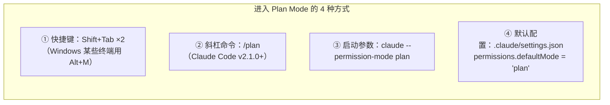
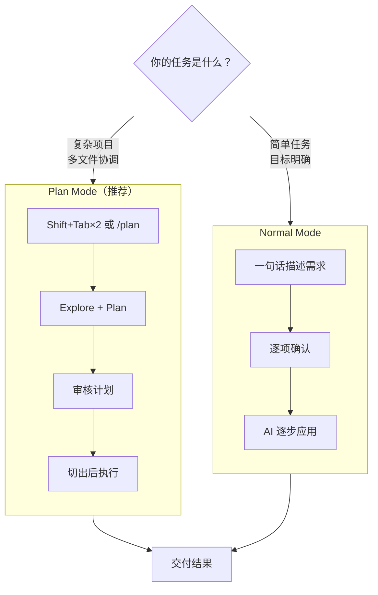

# AI Coding 零基础实战教程

## 第三部分：Claude Code 深度使用与进阶技巧

> **学习目标**：在掌握安装与基础配置后，深入掌握 Claude Code 的全部用法与进阶技巧，让 AI 真正成为你的高效编程搭档
>
> **完成标志**：能熟练使用 Claude Code 完成完整开发流程，并掌握高阶配置、最佳实践与进阶能力

好，到这里你已经能把 Claude Code 跑起来了。前面两部分你完成了：

- 第零部分：准备好了开发环境（Node.js、Git、VS Code 等）
- 第二部分：了解了AI编程工具生态，安装并配置好了 Claude Code，也理解了不同模型的特点与选型策略

但很多人就停在了这一步——会用，但用得不顺手。用久了你会发现三个问题：

1. **它怎么把文件改坏了？** → 你得学会管住它
2. **用着用着怎么变笨了？** → 你得学会管理上下文
3. **它对每个人都一样，怎么让它懂我？** → 你得学会个性化配置

本部分就是解决这三个问题的。先了解全局框架，再逐个深入。

---

Claude Code 的能力可以按 **7 层扩展（Harness）** 来理解。Anthropic 官方在 2026 年 5 月的企业级指南中总结了这个框架：

1. **CLAUDE.md** — 项目说明书，每次会话自动加载
2. **Hooks** — 事件触发器，在特定时机自动执行
3. **Skills** — 专业知识包，AI 按需加载
4. **Plugins** — 把 Skills + Hooks + MCP 打包分发
5. **LSP** — 给 AI 装上 IDE 级的代码导航
6. **MCP** — 连接外部工具和数据源
7. **子 Agent** — 独立上下文并行干活

这 7 层从底向上，每一层建立在前一层之上。前 3 层是基础配置，后 4 层是高级扩展。本部分和第四部分会逐个展开。

官方反复强调一个观点：**模型能力是地板，配置质量才是天花板**。花时间把配置做好，比追最新模型版本更有实际收益。

---

### 3.1 模型选择与切换

配置好API后，你可能会问："这么多模型，我该用哪个？"这一节帮你解答。

**Claude 模型家族对比：**

| 模型 | 速度 | 代码质量 | 推理能力 | 成本 | 推荐场景 |
|------|------|---------|---------|------|---------|
| Claude Haiku 4.5 |  极快 |  良好 |  中等 | $ 较低 | 简单代码补全、格式化、小修改 |
| Claude Sonnet 4.6 |  快 |  优秀 |  强 | $$ 适中 | 日常开发、功能实现（**默认推荐**） |
| Claude Opus 4.7 |  中等 |  顶级 |  极强 | $$$ 较高 | 复杂架构设计、疑难 Bug、算法难题 |

**成本估算参考（2026-05-18 核对）：**

| 模型 | 输入费用 | 输出费用 | 一次普通编程对话费用 |
|------|---------|---------|-------------------|
| Claude Haiku 4.5 | $1/百万Token | $5/百万Token | 低成本批处理 |
| Claude Sonnet 4.6 | $3/百万Token | $15/百万Token | 日常开发主力 |
| Claude Opus 4.7 | $5/百万Token | $25/百万Token | 复杂问题少量使用 |

> **提示**：日常开发使用 Sonnet 就足够了。只在遇到特别复杂的问题时才切换到 Opus。Haiku 适合大批量处理简单的任务。

**在 Claude Code 中切换模型（四种方式）：**

Claude Code 提供了四种模型切换方式，按优先级从高到低排列：

**方法一：启动时指定（临时使用）**

```bash
# 使用模型别名（推荐，自动指向最新版本）
$ claude --model opus      # 最强推理
$ claude --model sonnet    # 日常编码（默认）
$ claude --model haiku     # 快速轻量

# 使用具体模型名时，请以当前服务商官方文档为准
$ claude --model opus
$ claude --model "deepseek-v4-pro[1m]"
```

> **提示**：Claude Code 提供了方便的**模型别名**，常见包括 `opus`、`sonnet`、`haiku`、`default` 等。具体别名会随版本变化，使用前以 `/model` 当前显示为准。

**方法二：运行中切换（使用斜杠命令）**

在 Claude Code 对话中直接输入：

```
> /model           # 打开模型选择器（交互式）
> /model sonnet      # 直接切换到 Sonnet
> /model opus       # 直接切换到 Opus
```

选择后会保存到用户设置，下次启动也会生效。


**方法三：环境变量持久设置**

```bash
# 设置默认使用的模型（支持别名或具体名称）
export ANTHROPIC_MODEL="sonnet"
```

**方法四：配置文件持久设置（推荐）**

在 `settings.json` 中设置 `model` 字段，重启即生效：

```json
// ~/.claude/settings.json（全局生效）
{
  "model": "sonnet"
}
```

```json
// 项目/.claude/settings.json（仅该项目生效）
{
  "model": "opus"
}
```

> **注意**：四种方式的优先级为：`--model` 启动参数 > `ANTHROPIC_MODEL` 环境变量 > `settings.json` 中的 `model` 字段。`/model` 命令的选择会保存到用户设置文件。

**配置文件层级说明：**

| 配置文件位置 | 作用范围 | 是否提交 Git | 优先级 |
|---|---|---|---|
| `~/.claude/settings.json` | 全局（所有项目） | 否 | 低 |
| `项目/.claude/settings.json` | 当前项目（团队共享） | 是 | 中 |
| `项目/.claude/settings.local.json` | 当前项目（个人私有） | 否（gitignore） | 高 |

**不同模型的使用建议：**

| 场景 | 推荐模型 | 理由 |
|------|---------|------|
| 日常功能开发 | Claude Sonnet | 速度和质量的最佳平衡 |
| 简单代码修改/格式化 | Claude Haiku | 足够胜任，成本最低 |
| 复杂架构设计 | Claude Opus | 最强推理，值得多花钱 |
| Bug调试（简单） | Claude Sonnet | 通常够用 |
| Bug调试（复杂） | Claude Opus 或 DeepSeek V4 Pro | 需要深度推理 |
| 中文项目文档 | Claude Sonnet / 通义千问 | 中文能力出色 |
| 预算紧张 | DeepSeek API / GLM / Kimi | 按当前价格选择性价比方案 |
| 离线/隐私敏感 | 本地Ollama模型 | 完全本地，免费 |

**实际对比实验：**

用同一个任务测试不同模型的表现，帮你直观感受差异：

**测试任务**：用 Express.js 创建一个简单的 RESTful API，包含 GET 和 POST 两个端点。

```
> 请用 Express.js 创建一个简单的待办事项 API，包含：
> 1. GET /todos - 获取所有待办事项
> 2. POST /todos - 创建新的待办事项
> 数据存在内存中即可，不需要数据库。
```

| 模型 | 完成时间 | 代码质量 | 额外优化 |
|------|---------|---------|---------|
| Claude Haiku | ~3秒 | 功能正确，代码简洁 | 无额外优化 |
| Claude Sonnet | ~8秒 | 功能正确，有输入验证和错误处理 | 添加了 CORS、请求体解析中间件 |
| Claude Opus | ~15秒 | 功能正确，架构清晰 | 分层设计、详细注释、完整的错误处理 |
| DeepSeek V4 Pro | 视网络而定 | 功能正确，代码规范 | 适合低成本深度推理 |

> **提示**：模型选择没有绝对的对错，关键是**根据任务复杂度选择合适的模型**。简单任务用贵的模型是浪费钱，复杂任务用便宜的模型是浪费时间。

### 3.2 核心配置详解

Claude Code 有多层配置体系，从全局到项目级，层层覆盖。

**配置层级：**

```
全局配置（影响所有项目）
  └── ~/.claude/settings.json

项目级配置（只影响当前项目）
  └── 项目根目录/.claude/settings.json

项目上下文文件（告诉AI项目背景信息）
  └── 项目根目录/CLAUDE.md ← 最重要！
```

##### 3.2.1 settings.json 配置文件

Claude Code 的配置文件位于 `~/.claude/settings.json`（全局）或项目目录下的 `.claude/settings.json`（项目级）。

常用配置项：

```json
{
  // 允许 Claude Code 执行的操作（不再需要每次确认）
  "permissions": {
   "allow": [
     "Read",        // 读取文件
     "Write",       // 写入文件
     "Bash(npm *)",   // 执行 npm 命令
     "Bash(git *)",   // 执行 git 命令
     "Bash(node *)"   // 执行 node 命令
   ],
   "deny": [
     "Bash(rm -rf *)" // 禁止执行危险的删除命令
   ]
  },
  // 默认使用的模型
  "model": "sonnet",
  // 自动紧凑阈值（上下文使用超过此比例时自动压缩）
  "autoCompactThreshold": 80
}
```

> **注意**：权限设置要谨慎。过于宽松的权限可能导致AI执行你不期望的操作。建议初学者保持默认设置，让 Claude Code 在执行每个操作前都询问你确认。

##### 3.2.2 CLAUDE.md：你的项目"说明书"

CLAUDE.md 是 Claude Code 中**最重要的配置文件之一**。它就像你给新来的实习生写的"项目入职手册" —— 告诉AI这个项目的背景、技术栈、编码规范和当前进度。

**为什么 CLAUDE.md 如此重要？**

没有 CLAUDE.md 时，Claude Code 每次开始工作都要花时间"重新认识"你的项目。有了 CLAUDE.md，它一启动就知道项目的全部背景，效率大幅提升。

**CLAUDE.md 模板（可直接复制修改）：**

````markdown
# 项目名称

## 项目概述
一句话描述这个项目做什么。

## 技术栈
- 前端：Next.js 14 + TypeScript + Tailwind CSS
- 后端：Next.js API Routes
- 数据库：Prisma + SQLite
- 部署：Vercel

## 项目结构
​```
src/
├── app/         # Next.js App Router 页面
│   ├── api/      # API 路由
│   ├── layout.tsx # 全局布局
│   └── page.tsx   # 首页
├── components/   # React 组件
│   ├── ui/      # 通用UI组件
│   └── features/  # 业务组件
├── lib/         # 工具函数和配置
├── prisma/      # 数据库 schema 和迁移
└── types/       # TypeScript 类型定义
​```

## 编码规范
- 使用函数式组件 + React Hooks
- 组件文件使用 PascalCase 命名（如 BookmarkCard.tsx）
- 工具函数使用 camelCase 命名
- API 路由返回统一格式：{ success: boolean, data?: any, error?: string }
- 所有数据库操作通过 Prisma Client 执行

## 当前开发状态
-  项目初始化完成
-  数据库 Schema 设计完成
-  书签 CRUD API 开发中
-  前端页面待开发
-  搜索功能待开发

## 注意事项
- SQLite 数据库文件在 prisma/dev.db，不要提交到 Git
- 环境变量在 .env 文件中，不要提交到 Git
- 所有新功能先创建 Git 分支再开发
````

**CLAUDE.md 的三个层级（由顶向下叠加生效）：**

很多人只知道 CLAUDE.md 可以放在项目根目录，其实官方设计了 **3 个层级的 CLAUDE.md**，它们会同时生效、不冲突：

| 层级 | 路径 | 作用范围 | 适合写什么 |
|------|------|----------|------------|
| **全局级** | `~/.claude/CLAUDE.md` | 所有项目都会读 | 个人习惯、身份、翻译偏好（如"永远用中文回答"、"我是 xx、从事 xx"） |
| **项目级** | 项目根目录/`CLAUDE.md` | 仅本项目 | 项目技术栈、架构、规范、进度（可提交 Git，团队共享） |
| **文件夹级** | 子目录/`CLAUDE.md` | 仅该子目录 | 模块专属约定（如 `src/payment/CLAUDE.md` 写支付模块踩过的坑） |

三层叠加生效，不冲突。优先级：文件夹级 > 项目级 > 全局级。

**两个官方推荐的创建姿势：**

- **`/init` 创建项目级**：在项目根目录下运行 `claude` 后输入 `/init`，cc 会自动扫描项目并生成一份 CLAUDE.md 初稿，你再调整。官方建议：**项目有一定规模再 `/init` 效果更好**（太空它扫不出什么东西）。
- **`/memory` 编辑全局级**：在 cc 会话里输入 `/memory` 选择“全局 CLAUDE.md”，会用默认编辑器打开该文件供你修改。**修改全局后需重启 cc 才生效。**

**最佳实践：**

1. **保持更新**：项目级 CLAUDE.md 应该是动态的——项目加了功能、踩了坑，就同步更新

2. **足够具体**：技术栈写明具体版本号，目录结构要与实际一致

3. **写明禁忌**：把"不要做什么"也写清楚（如"不要修改数据库迁移文件"）

4. **适度简洁**：不要写成论文，AI需要的是关键信息而非赘述

5. **只放"顶层不变原则"**：随着实践你会发现，CLAUDE.md 不该塞太多。卡帕西发布的「claude.skills」几百行通用规则就能拿 10 万+ Star——写点 “顶层、不变、须严守" 的东西就够了。

   ```
   https://github.com/multica-ai/andrej-karpathy-skills
   ```

##### 3.2.3 第二层记忆：Auto Memory（cc 自己的笔记本）

如果说 CLAUDE.md 是**你主动立下的规矩**，那 Auto Memory 就是 **cc 在干活过程中默默记下的设计笔记**。你没显式写进 CLAUDE.md 的习惯、反馈、项目踩坑，会被一个后台 agent 静静记录。

**如何启用：**

```bash
# 在 cc 会话中输入
/memory

# 在弹出的菜单里选第一个选项 “启用 Auto Memory”
# 启用后菜单里会多出“打开自动记忆文件夹”选项
```

**Auto Memory 会记哪几类东西：**

| 类型 | 含义 | 举例 |
|------|------|------|
| `user` | 关于你 | 你的角色、偏好（如“不喜欢深色 UI”） |
| `feedback` | 你给过的反馈 | “不要这样做"、“对，就这样" |
| `project` | 项目相关 | 进度、决策、技术选型 |
| `reference` | 外部资源索引 | “某份设计文档在 docs/design.md” |

**使用手感（重要）：**

- 它只在当前项目生效（文件存在项目目录下），换项目需重新积累
- 启用后 cc 不会每次都把所有记忆全部加载进上下文，只会读一份 `memory.md` 索引——**遇到具体问题才去读对应的子文件**，占 token 很少
- 随时可以用快捷键 `Ctrl+O` 在会话中查看实际被调用过的记忆内容
- 记错了就跟它说：“忘掉刚刚说的不喜欢深色主题”，它会自己删掉

> 提示： **一句话区分 CLAUDE.md vs Auto Memory**：CLAUDE.md 是**第一优先级、全量注入的明规则**；Auto Memory 是**第二优先级、按需注入的隐规则**。两者配合，cc 越用越懂你。

##### 3.2.4 第三层记忆：自建参考文档（渐进式披露）

除了上面两层，你还可以仿照 Skill 的"**渐进式披露**"机制为 cc 手动打造一套**专项参考文档**。

**应用场景**：某些东西不适合全部塞进 CLAUDE.md（太长、太专门），但 cc 需要的时候必须能查到。比如做个产品，你希望：

- **品牌视觉规范**：颜色、字体、间距 → `docs/brand-visual.md`
- **产品文本风格**：语调、术语表 → `docs/copywriting-style.md`
- **API 约定**：请求响应格式、错误码 → `docs/api-conventions.md`

然后在 CLAUDE.md 里加上指引：

```markdown
## 外部参考文档

- 修改前端视觉、调颜色、调间距时 → 必读 `docs/brand-visual.md`
- 写产品文案、按钮文字、提示语时 → 必读 `docs/copywriting-style.md`
- 写 API 、定义返回格式时 → 必读 `docs/api-conventions.md`
```

这样 cc 只在"需要的时候"才去读完整文档，既保证了准确性，又不占多余上下文。

##### 3.2.5 三层记忆总览

Claude Code 的三层记忆体系：第一层 CLAUDE.md（你主动写，全量加载）→ 第二层 Auto Memory（cc 自己记，按需读取）→ 第三层自建参考文档（你写，cc 遇到对应任务才读）。

| 层 | 位置 | 优先级 | 加载方式 | 谁在维护 |
|----|------|--------|----------|----------|
| 1 | CLAUDE.md（三级） | 高 | 会话启动全量加载 | 你手动维护 |
| 2 | Auto Memory | 中 | 先读索引、按需读子文件 | cc 自己写、你校对修改 |
| 3 | 参考文档 | 按需 | cc 遇到对应任务才读 | 你手动维护 |

>  **本质认知**：agent 的所有"记忆"，本质上都是在**合适的时候向大模型注入压缩过的上下文**。粗暴点说 —— 这些记忆机制本质上还是提示词工程，只不过由 cc 帮你组织了层次。

##### 3.2.6 .claudeignore 文件

类似于 `.gitignore`，用来告诉 Claude Code 哪些文件/目录不需要关注：

```
# .claudeignore 示例
node_modules/      # 依赖包目录（太大了，AI不需要看）
.next/            # Next.js 构建产物
dist/            # 编译输出
*.log            # 日志文件
.env             # 环境变量（包含敏感信息）
```

### 3.3 核心命令与日常使用

掌握 Claude Code 的日常使用，就像学会开车的基本操作 —— 方向盘、油门、刹车、倒车镜。

##### 3.3.1 启动与基本交互

```bash
# 最基本的启动方式（在当前目录启动）
$ claude

# 指定项目目录启动
$ claude --project-dir /path/to/your/project

# 使用指定模型启动
$ claude --model sonnet

# 单次执行模式（执行完就退出，适合脚本调用）
$ claude -p "请列出当前目录下所有的 JavaScript 文件"
```

##### 3.3.2 对话交互基础

启动 Claude Code 后，你就进入了一个交互式对话界面。你输入需求，AI分析后执行。

**典型的交互流程：**

```
你：帮我创建一个简单的 HTML 页面，显示"Hello AI Coding"

AI：好的，我来创建这个页面。

[AI 分析需求]
[AI 请求确认：我将创建文件 index.html，是否允许？]

你：是（按 Enter 确认）

AI： 已创建 index.html，包含以下内容：
   - 基本 HTML5 结构
   - 一个标题显示"Hello AI Coding"
   - 简单的居中样式
```

**权限确认机制：**

Claude Code 在执行以下操作前会先询问你：

| 操作类型 | 示例 | 提示信息 |
|---------|------|---------|
| 创建文件 | 创建 `index.html` | "Will create file: index.html" |
| 修改文件 | 修改 `app.js` 的第10行 | "Will edit file: app.js" |
| 执行命令 | 运行 `npm install express` | "Will run: npm install express" |
| 删除文件 | 删除 `temp.txt` | "Will delete file: temp.txt" |

你可以：
- 按 **Enter** 或输入 **y** → 确认执行
- 输入 **n** → 拒绝执行
- 输入补充信息 → 修改AI的计划

> **提示**：如果你发现每次确认很烦，可以在 `settings.json` 中配置自动允许的操作（见 4.2 节）。但初学者建议保持默认，让自己有机会审查AI的每一步操作。

##### 3.3.3 核心斜杠命令详解

在 Claude Code 对话中，以 `/` 开头的命令是“斜杠命令”，用来控制Claude Code 的行为。在输入框里打一个 `/` 就会弹出完整命令清单；`/help` 列出所有可用指令。

**基础高频命令：**

| 命令 | 作用 | 使用场景 |
|------|------|---------|
| `/help` | 显示帮助信息 | 忘记命令时查看 |
| `/model` | 查看/切换当前模型（高/中/低档） | 需要换用更强/更快的模型时 |
| `/compact` | 压缩当前对话的上下文 | 对话太长，AI开始“遗忘”早期内容时 |
| `/clear` | 完全清空当前对话 | 开始全新的任务时 |
| `/context` | 详细查看上下文占比（各 MCP/Skill 各占多少） | 优化 token、诊断哪里挨上下文 |
| `/memory` | 查看/编辑 CLAUDE.md 与自动记忆 | 管理项目/全局记忆、开启 Auto Memory |
| `/status` | 查看会话状态 | 确认模型、Token 消耗 |
| `/cost` | 查看当前会话费用 | 监控花了多少钱 |
| `/review` | 对当前项目进行代码审查 | 完成功能后检查质量 |
| `/init` | 自动生成项目的 CLAUDE.md | 进入新项目后的第一件事 |
| `/plan` | 切入 Plan Mode（只读规划模式） | 复杂任务起手（详见 4.9 节） |
| `/rewind` | 回滚 cc 之前的修改 | “后悔药”，下面重点讲 |
| `/resume` | 选择历史会话恢复 | 上次话题还没聊完 |
| `/btw` | “顺便问一句”，不污染主上下文 | 主任务进行中想问个无关问题 |

**扩展管理命令：**

| 命令 | 作用 | 使用场景 |
|------|------|---------|
| `/skill <名称>` | 直接调用某个 Skill | 手动触发，不要等 AI 自己决定 |
| `/agent` | 创建、查看、调用子代理（SubAgent） | 手工创建专项 SubAgent |
| `/plugin` | 插件管理界面（discover / installed） | 发现、安装、卸载插件 |
| `/login` | 使用 Claude 官方订阅会员登录 | 有 Claude Pro/Max 会员时首选 |
| `/simplify` | 派 3 个子 Agent 从代码质量/性能/复用性三个角度优化 | 快速全面优化已有代码 |

**最常用的三个命令详解：**

**`/compact` —— 上下文压缩（必须掌握）**

这是解决”用久了 AI 变笨”的核心武器。用 cc 一段时间会发现回答变慢、质量下降——这是因为你聊的每句话、它读的每个文件、它执行的每个操作的结果，都在挤占上下文空间。模型上下文虽然有 200K，但实际有效比例只有 60%-80%，且会随上下文增多能力下降。脑子里塞多了东西，它就容易把握不住重点。

`/compact` 命令会帮你”整理桌面” —— 把前面的对话压缩成摘要，腾出空间。

```
> /compact

AI: 上下文已压缩。当前对话摘要：
   - 我们正在开发一个书签管理器项目
   - 已完成：数据库设计、API端点
   - 当前正在：前端页面开发
```

**配套命令：`/context` —— 监控上下文余量**

在 `/compact` 之前，先用 `/context` 看看当前状况：它会详细展示上下文占比，包括各个 MCP、Skill 各占用了多少 token，让你知道是什么在”吃掉”上下文。

```
> /context

上下文使用情况：
  已使用: 142,000 / 200,000 tokens (71%)
  ├── 对话历史: 89,000 tokens
  ├── CLAUDE.md: 2,100 tokens
  ├── Skills: 12,500 tokens
  └── MCP 工具: 4,800 tokens
```

> 提示： **我的习惯**：看到上下文高于 60% 了，就 `/compact` 一下。别等到接近满载、cc 自动压缩才动手——那时候它已经开始”遗忘”了。也可以让 cc 帮你打开常驻显示，重启终端后底部就会一直显示上下文余量。

**`/compact` vs `/clear` —— 什么时候用哪个？**

| 命令 | 效果 | 适用时机 |
|------|------|---------|
| `/compact` | 压缩历史为摘要，保留关键决策 | 同一任务对话过长、但还要继续做 |
| `/clear` | 彻底清空，等于重开 | 一个独立任务彻底结束，要开始全新任务 |

>  **心法**：宁可”多 `/clear` 几次重新介绍背景”，也不要”一直聊一直聊”。每个 `/clear` 都是给 AI 一次重新聚焦的机会。

**`/rewind` —— “后悔药”（双击 ESC 快捷启动）**

当你让 cc 改了一些代码、过后发现不满意（或者项目被改坏了），cc 自带一个回滚机制：**在对话里输入 `/rewind`，或者直接双击 `ESC`**，就会进入回滚界面：

```
[Rewind] 选择回滚方式：
  1. 仅回滚对话        → 文件保留，只清除后面几轮对话
  2. 回滚对话 与 文件编辑 → 推荐！全部返回某个节点
  3. 仅回滚文件        → 保留对话，只还原文件
```

> 注意： **底线提醒**：`/rewind` 只能撤销 **cc 自己编辑过的文件**。它跑过的终端命令（安装依赖、下载文件、修改数据库）**撤不了**。真正靠谱的“后悔药”还是 Git（参见 4.5 节“Git 集成最佳实践”）。

**`/memory` —— 记忆管理**

Claude Code 有一个跨会话的“长期记忆”系统。它会自动记住你的偏好和项目信息，下次启动时依然记得。`/memory` 进去后可以编辑全局 / 项目 CLAUDE.md、开启自动记忆。具体记忆体系见 **4.2 节 记忆系统**。

**`/review` —— 代码审查**

完成功能开发后，让 AI 审查你的代码质量：

```
> /review

AI: 正在审查项目代码...

审查结果：
 代码结构清晰
注意： api/bookmarks.ts 第15行：缺少输入验证
注意： components/BookmarkList.tsx：建议添加 loading 状态
 发现潜在安全问题：SQL 查询未使用参数化查询
```

##### 3.3.4 快捷键速查

| 快捷键 | 作用 |
|--------|------|
| `Enter` | 发送消息 / 确认操作 |
| `Shift + Enter` | **也是发送**（不是换行！超多新手在这里发出了半截提示词） |
| `Option + Enter`（Mac） | 换行输入（在提示词里换行不发送） |
| `Ctrl + Enter`（Windows） | 换行输入（同上） |
| `Ctrl + C` | 中断当前操作 |
| `Esc` | 取消正在生成的内容 |
| `Esc × 2`（双击） | 启动 `/rewind` 回滚界面 |
| `Shift + Tab` | 三种运行模式循环切换（Normal/Auto-Accept/Plan，详见 4.9） |
| `↑` / `↓` | 浏览历史消息 |
| `Ctrl + B` | 让当前运行的命令到**后台**跑（不阻塞对话） |
| `Ctrl + O` | 查看 Auto Memory 记录的具体内容 |

##### 3.3.5 输入与交互高级技巧

除了打字对话，cc 还有几种交互方式能大幅提升效率。

**1. `!` 进入 Bash 模式（不用新开终端跑命令）**

在 cc 对话窗口里输入文字默认是在跟 cc 对话，不是跑 shell 命令。要跑命令有两种常见做法：

```bash
 推荐：在 cc 会话里以 ! 开头，进入 Bash 模式跑命令
> !npm run dev
> !node app.js

# 取代方案：另外开一个终端跑命令
```

> 提示： **后台运行**：运行中的命令会阻塞跟 cc 的对话（比如 dev 服务起来后不会退出）。这时按 `Ctrl+B`，cc 会把它交到后台跑，你可以继续与 cc 对话。

**2. `@文件/目录` 引用（给 cc 精准上下文）**

cc 不会一直把所有项目文件加载到上下文里（项目一大也加不进去），需要时会现场 grep。**你明确 `@` 一个文件，就是在节省 cc 探路的 token 成本**。

```
# 直接 @ 文件路径（输入时会自动弹出候选）
> 参考 @src/auth/login.ts 的风格，在 @src/auth/ 下加个 register.ts

# 提示词太长、命令行里打不下？先写到 .md 文档里，再 @ 它
> 按 @docs/feature-spec.md 的需求实现
```

> 提示： **反直觉小冗识**：你给 cc 的指令**越短，它反而可能花越多 token**——因为它要多费力探索项目才能猜到你想要什么。描述越具体 + 明确 @ 文件，成本反而低，效果反而准。

**3. 贴图片（多模态能力）**

直接将图片拖拽到对话框、或者 Ctrl+V 粘贴。适合：

- 给设计参考图让 cc 实现一个类似的 UI
- 贴报错截图让 cc 判读
- 贴架架构图让 cc 按图实现

**4. 三种启动参数（命令行启动时）**

```bash
claude                        # 默认启动
claude -c                      # = --continue，启动时直接接上次会话
claude --permission-mode plan       # 启动后直接进 Plan Mode（8 节）
claude --dangerously-skip-permissions # "危险模式"：一路绿灯不问任何确认
```

> 注意： **危险模式使用须谨慎**：`--dangerously-skip-permissions`（绿灯模式）适合在**沙箱环境 / 有 Git 存档 / 不重要的练手项目**中使用。生产项目里不推荐，新手也请从默认模式起手。

### 3.4 Claude Code 实战工作流

了解了基本操作后，让我们来看一个完整的开发工作流。这就像学会了方向盘和油门后，实际上路开一圈。

##### 3.4.1 官方推荐工作流：**Explore → Plan → Implement → Commit**

Claude Code 的常见推荐工作流可以概括为 **四阶段**：

1. **Explore（探索）**：Plan Mode 下读代码、搜引用，搞清楚现状
2. **Plan（规划）**：出方案、评估边界情况，你审核
3. **Implement（实施）**：切出 Plan Mode，按方案执行
4. **Commit（提交）**：生成 commit message，提交

一轮结束后，回到第 1 步开始下个任务。

**各阶段详解：**

| 阶段 | 你该做什么 | AI 在做什么 | 推荐模式 |
|------|----------|------------|----------|
| **① Explore（探索）** | 告诉 AI 要改动的区域 | 读相关文件、grep、跟引用 | Plan Mode |
| **② Plan（规划）** | 让 AI 出详细方案并由你审核 | 生成计划、评估边界情况 | Plan Mode |
| **③ Implement（实施）** | 切出 Plan Mode 按计划执行 | 按顺序修改文件、运行构建 | Normal / Auto-Accept |
| **④ Commit（提交）** | 让 AI 生成提交消息并 commit | 生成 commit message、可选开 PR | Normal |

> 提示： **为什么要分阶段？** 试想一下这种体验：你说”加个软删除功能”，15 分钟后 AI 改了 14 个文件、动了全局查询过滤器、破坏了 3 个现有接口——你只能一个一个手工回退。**这就是不规划直接干的代价。** 在 Plan Mode 里多花 5 分钟讨论方案，换来执行阶段节省 30 分钟返工。Plan Mode 的详细用法在 **4.9 节** 详讲。

##### 3.4.2 项目设置（6个应该习惯性做的动作）

在开始一个新项目之前，完成以下 6 项设置能让后续开发顺利多倍：

```
Step 1: 项目初始化
  ↓ 描述项目目标 → AI 生成项目骨架
Step 2: 建立 CLAUDE.md（项目上下文）
  ↓ 可运行 `/init` 让 AI 自动生成
Step 3: 配置权限与默认模式
  ↓ .claude/settings.json、复杂项目可默认 plan 模式
Step 4: 功能开发
  ↓ 一次一个功能，逐个 Explore→Plan→Implement
Step 5: 代码审查与测试
  ↓ 用 /review 让 AI 生成测试并跑起来
Step 6: 提交代码
  ↓ git commit 保存进度
```

##### 3.4.3 完整示例：用 Claude Code 创建一个 Express Hello World API

让我们用一个小例子走完整个流程，让你亲身体验 Claude Code 的威力。

**Step 1：初始化项目**

```bash
# 创建项目目录
$ mkdir hello-api
$ cd hello-api

# 启动 Claude Code
$ claude
```

在 Claude Code 中输入：

```
> 请帮我初始化一个 Node.js Express 项目：
> 1. 使用 npm init 创建 package.json
> 2. 安装 express
> 3. 创建一个 app.js 入口文件
> 4. 实现一个 GET /hello 端点，返回 { message: "Hello AI Coding!" }
> 5. 端口使用 3000
```

AI 会依次执行以下操作（每一步都会请求你确认）：

```
[Claude Code] 将运行命令: npm init -y
→ 确认？(y/n) y

[Claude Code] 将运行命令: npm install express
→ 确认？(y/n) y

[Claude Code] 将创建文件: app.js
→ 确认？(y/n) y
```

预期生成的核心代码（`app.js`）：

```javascript
// 引入 Express 框架
const express = require('express');

// 创建应用实例
const app = express();

// 定义端口号
const PORT = 3000;

// 定义 GET /hello 路由
app.get('/hello', (req, res) => {
  // 返回 JSON 格式的响应
  res.json({ message: 'Hello AI Coding!' });
});

// 启动服务器
app.listen(PORT, () => {
  console.log(`服务器已启动，访问 http://localhost:${PORT}/hello`);
});
```


**Step 2：运行并验证**

在 Claude Code 中输入：

```
> 请启动这个服务器，然后用 curl 测试 /hello 端点
```

AI 执行的操作：

```
[Claude Code] 将运行命令: node app.js
→ 确认？(y/n) y

输出: 服务器已启动，访问 http://localhost:3000/hello
```

你也可以打开浏览器访问 `http://localhost:3000/hello`，应该看到：

```json
{
  "message": "Hello AI Coding!"
}
```

>  **验证**：如果浏览器能看到上面的 JSON 响应，恭喜！你用 Claude Code 成功创建了第一个 API！

**Step 3：提交代码**

```
> 请帮我初始化 Git 仓库并提交当前代码，commit message 为 "初始化 Express Hello World API"
```

AI 会执行：

```
git init
git add .
git commit -m "初始化 Express Hello World API"
```


### 3.5 Claude Code 最佳实践

经过大量实践总结出的使用技巧，帮你事半功倍。

##### 3.5.1 Prompt 编写技巧（针对 Claude Code 场景）

**1. 任务描述要具体，不要模糊**

```
 差：帮我做一个登录功能
 好：在 /api/auth/ 目录下创建登录 API：
   - POST /api/auth/login
   - 接受 { email, password }
   - 使用 bcrypt 验证密码
   - 成功返回 JWT token
   - 使用项目已有的 prisma client 查询 User 表
```

**2. 引用已有代码作为参考**

```
 好：参考 /api/bookmarks/route.ts 的风格，
   为 /api/tags/ 创建类似的 CRUD 接口。
   数据模型参见 prisma/schema.prisma 中的 Tag 表。
```

**3. 先让AI制定计划，确认后再执行**

```
 好：我想给书签管理器添加搜索功能。
   请先分析一下需要修改哪些文件，列出计划，
   等我确认后再开始实现。
```

**4. 一次只做一件事**

```
 差：帮我同时添加搜索功能、标签管理、用户认证和导出功能
 好：帮我先实现书签搜索功能。具体需求：
   - 在书签列表页面添加搜索框
   - 支持按标题和描述搜索
   - 搜索时实时过滤结果（前端过滤即可）
```

##### 3.5.2 上下文管理策略（快速参考）

上面 `/compact` 详解已覆盖核心操作，这里给你一个快速决策表：

| 你观察到的情况 | 是什么问题 | 该怎么做 |
|--------------|----------|---------|
| 响应变慢、质量下降 | 上下文快满了 | `/context` 看占比 → 高于 60% 就 `/compact` |
| AI 开始"遗忘"早期约定 | 早期信息被挤出窗口 | 立即 `/compact` |
| AI 重复问已回答过的问题 | 上下文混乱 | `/clear` 开新会话 |
| 要切换到完全不同的任务 | 避免上一个任务的思路污染 | `/clear` 开新会话 |
| 想永久记住某条规则 | 跨会话记忆 | `/memory` 开启 Auto Memory 或写入 CLAUDE.md |

##### 3.5.3 Git 集成最佳实践

在深入 Git 技巧之前，先给你一个直观理解：**Git 就是你的"游戏存档系统"**。哪怕你不是程序员，只要在用 cc 做项目，Git 都是你的生命线。

想象你玩一个 RPG 游戏：打到 BOSS 前存个档 → 打输了就读档重来 → 打赢了就存新档继续。Git 在项目中就是完全一样的东西：**打到一个满意的节点存一档，后面翻车就读档回来。**

> 注意： **cc 有不确定性，这不是 bug 是特性**：cc 不管是写代码还是其他文档操作，都有不确定性——同一个需求问两次，可能得到不同的实现。所以养成一个肌肉记忆：**每做完一步就让 cc 存档一步**。有 Git 兜底，你才能安心让 cc 去尝试各种方案。

Mac 自带 Git，Windows 让 cc 帮你装。最好建个 GitHub 账号——远程仓库可以让你在其他电脑上拉下存档点继续工作，也方便协作。Git 的下载、安装、登录、提交、回滚，**全都可以让 cc 用自然语言帮你完成**，比如说：

```
> 帮我下载 Git 并跟我的 GitHub 账号绑定
> 帮我把现在的代码提交到远程仓库
> 回滚到上一个存档版本
```

```
黄金法则：在让AI做大修改之前，先 commit

开发流程：
1. git commit → 保存当前状态（"存档"）
2. 让 AI 实现新功能
3. 测试功能是否正常
   ├── 正常 → git commit → 继续下一个功能
   └── 有问题 → git checkout . → 回到步骤1，换个方式重试
```

```bash
# 实际命令示例

# 1. 开始新功能前，先保存
$ git add . && git commit -m "开始添加搜索功能前的存档"

# 2. 在 Claude Code 中实现功能...
# （如果功能做坏了）

# 3. 回退到存档点
$ git checkout .

# （如果功能做好了）
# 3. 保存新功能
$ git add . && git commit -m "完成搜索功能"
```

>  **验证**：如果你在项目里已经用了 git，现在停一下想想——你敢放心地让 cc 去重构一段复杂代码，因为你知道改坏了随时能回退吗？如果答案是否定的，先把 git 配好再继续。

>  **避坑**：很多初学者不 commit 就让 AI 大改特改，结果改坏了却无法回退。这是AI编程中最常见也最痛苦的失误。**"改之前先存档"**，记住这句话。

##### 3.5.4 费用控制策略

| 策略 | 方法 | 节省比例 |
|------|------|---------|
| 分级使用 | 简单任务用 Haiku/DeepSeek，复杂任务用 Sonnet | 30-50% |
| 精准描述 | 减少来回修改次数 | 20-30% |
| 及时 /compact | 避免重复发送长上下文 | 10-20% |
| 使用 /cost 监控 | 实时了解消耗 | - |
| 设置预算上限 | Anthropic Console 中设置月度限额 | 防止超支 |

```
> /cost

AI: 当前会话费用统计：
   输入 Token: 15,234
   输出 Token: 8,721
   估算费用: $0.18
```

##### 3.5.5 大型代码库最佳实践（Anthropic 官方推荐）

以上技巧偏通用。如果你接手的是一个**多人协作、几十万行以上的大型代码库**，Anthropic 官方在大型代码库实践中给出过多条专门建议。核心矛盾是：即使模型上下文已经很长，真实代码库仍然可能远超窗口上限。前 3 条是纪律，后 3 条是武器。

**① 用 `/init` 自动生成 CLAUDE.md（项目初始化）**

第一次在一个新项目里跑 Claude Code，**第一件事就是 `/init`**：

```
> /init
```

AI 会自动浏览项目目录、识别技术栈、读 README 和关键配置文件，生成一份初版 `CLAUDE.md`。然后你只要在它的基础上**手工补充三类信息**：

| 必补内容 | 为什么 | 示例 |
|---------|--------|------|
| **项目目录地图** | 让 AI 知道“去哪儿找代码” | `认证逻辑在 src/auth/，UI 组件在 src/components/`|
| **不要碰的禁区** | 防止 AI 改坏 | `不要修改 prisma/migrations/，不要动 vendor/` |
| **团队约定** | 风格统一 | `所有 API 必须返回 { success, data, error }` |

> 提示： **CLAUDE.md 是“起点上下文”，不是“全部上下文”**。它就像一份给新人的入职手册，AI 看完后再现场探索代码——这正是 Agentic Search 的工作方式（参见 2.2.1 节）。

**② 任务粒度要小且聚焦（避免“万能 prompt”）**

大型代码库里**最害人的就是“一句话扔给 AI 整个大需求”**。正确做法：

```
 反例：帮我重构整个支付模块，加入新风控、新对账、新通知、新报表
 正解：第一步——在 src/payment/risk/ 下抽出风控规则引擎，
       接口签名见 docs/risk-rules.md，先不动调用方代码
```

**经验值**：每个 Claude Code 任务 ≤ 涉及 5 个文件 / 200 行代码改动。超过这个量级就该拆。

**③ 频繁重置上下文（`/clear` 是好朋友）**

很多新手以为对话越长 AI 越懂自己，**这恰恰是大型代码库里最大的坑**：

- 上下文里塞的越多，无关代码片段越多，AI 越容易抓错重点
- 上一任务的失败尝试、错路径、错假设，会污染下一个任务

**官方建议**：

| 时机 | 操作 | 区别 |
|------|------|------|
| 一个独立任务结束（PR 提交后） | `/clear` | 完全清空对话，从零开始 |
| 同一任务内对话过长 | `/compact` | 压缩历史摘要，保留关键决策 |
| 想换条思路重做 | 退出 `claude` 重新启动 | 连状态栏模式都重置 |

>  **核心心法**：宁可“多 clear 几次重新介绍背景”，也不要“一直聊一直聊”。每个 `/clear` 都是给 AI 一次重新聚焦的机会。

**④ 复杂任务从 Plan Mode 起手（权限控制）**

详见 4.9 节。一句话：**陌生代码库或一动牵全身的修改，永远先 `/plan` 或 `Shift+Tab×2`**，让 AI 在只读模式下先勘探出方案再动手，回退成本几乎为零。

**⑤ 用 Skills 与 Subagents 卸载长任务**

大型代码库里有些“调研型任务”天生很费 token：

- 找出所有调用了某废弃 API 的地方
- 梳理某个模块的依赖图
- 跨 50 个文件的批量重命名前的影响评估

这类任务**不要让主会话亲自做**，而是：

- **派 Subagent**：让一个独立的子代理去调研，最后只把结论带回主上下文（Plan Mode 下会自动调用）
- **写成 Skill**：把高频调研流程封装成 Skill，每次一键触发（详见第四部分）

这样主会话的上下文窗口尽量留给“看结论、做决策、写代码”这些核心动作。

**⑥ 接入 MCP / LSP（给 AI 装上团队协作工具）**

一个真正的工程师不是只看代码，还会查 Jira、读 Confluence、连数据库、用 IDE 的“跳到定义”。Claude Code 通过 **MCP（Model Context Protocol）** 把这些能力接进来：

| 接入对象 | 解决什么 | 典型场景 |
|---------|---------|---------|
| **GitHub MCP** | 读 PR、Issue、CI 日志 | “这个 bug 在 PR #1234 里讨论过，看一下” |
| **数据库 MCP**（Postgres / MySQL） | 直接查数据 | “线上 user 表里有多少条 deleted_at 不为空的”|
| **Jira / Linear MCP** | 读任务卡 | “按 PROJ-123 的需求实现” |
| **LSP（语言服务器）集成** | 精确跳转、查类型、找引用 | 等同于 IDE 的“查找所有引用” |
| **Sentry / Datadog MCP** | 读告警、堆栈 | “上一小时的 5xx 错误调一下” |

> 提示： **配置入口**：`.claude/settings.json` 中的 `mcpServers` 字段，或运行 `claude mcp add ...`。MCP 详细配置在第四部分 3.6 节讲解。

##### 3.5.6 大型代码库最佳实践速查表

| 实践 | 命令/入口 | 何时做 | 收益 |
|------|----------|--------|------|
| 项目初始化 | `/init` + 手工补充 | 第一次进入项目 | 让 AI 知道地图与禁区 |
| 任务拆分 | 心法（无命令） | 每次提需求前 | 避免 AI 改坏一大片 |
| 上下文重置 | `/clear` / `/compact` | 任务结束 / 上下文过长 | 避免污染、节省 token |
| 规划优先 | `/plan` 或 `Shift+Tab×2` | 复杂任务起手 | 先勘探后动手 |
| 任务卸载 | Subagent / Skill | 高频调研类任务 | 保护主上下文 |
| 工具接入 | `claude mcp add ...` | 项目初配 | 让 AI 看见“代码之外” |

##### 3.5.7 三个容易被忽视的官方进阶建议

这三点在官方博客里被反复强调，但实际使用中最容易被新手跳过。

**1. 在子目录初始化 Claude，别从仓库根目录开始**

这点在 monorepo 里反直觉但极重要：

```bash
 反例：在 monorepo 根目录下启动
user@monorepo $ claude
# AI 看到三百个服务、上千个包，上下文污染严重

 正解：进入你要改的子目录启动
user@monorepo $ cd services/payment
user@monorepo/services/payment $ claude
# Claude 会自动向上遍历加载所有 CLAUDE.md（根目录的也会加）
# 但工作范围被精准限定在了相关代码区域
```

**配套做法**：每个子目录都放一份小的 `CLAUDE.md`，写明**该目录专用的测试与 lint 命令**。不要让 AI 改了一个服务就去跑整个仓的测试套件——那就等着超时吧。

**2. 配置要定期审查（每 3-6 个月）**

为当前模型写的指令，在下一代模型上可能适得其反。官方举了两个真实例子：

| 过期配置 | 何时有效 | 为何失效 |
|---------|---------|---------|
| `CLAUDE.md` 里要求“每次重构只改一个文件” | 老模型需要保持专注 | 新模型能跨文件协调编辑，这条反而是枷锁 |
| Hook 每次文件写入时跑 `p4 edit` | Claude 未原生支持 Perforce 时 | Claude Code 已原生支持 Perforce，这个 Hook 变多余 |

> 提示： **实践建议**：设个日历提醒，每 3-6 个月、或每次大模型发布后，重读一遍 `CLAUDE.md` / `.claude/settings.json` / `.claude/hooks` / `.claude/skills`，问三个问题：“这条还需要吗？”“现在有更好的写法吗？”“这条是在弥补哪代模型的缺陷？”

> 注意： **预警信号**：如果你觉得 Claude Code 表现到了某个瓶颈怎么也上不去，问题很可能**不在模型，而在你的配置没跟上**。模型都已经往前跑了，你的 CLAUDE.md 可能还停在三个月前。

**3. 团队内应该有个“人”负责 Claude Code（DRI / Agent Manager）**

这点是面向团队使用者的，个人开发者可以跳过。Anthropic 观察到：推广最快的组织，都是“先有一小队人把基础设施搭好”才大面积开放的。

| 规模 | 必须人选 | 职责 |
|------|---------|------|
| 小团队（< 20 人） | **DRI**（直接责任人），选一个有兴趣的人选充当 | 项目级 CLAUDE.md、共享的 Skills、Plugins 选型 |
| 中型企业 | **Agent Manager**（半PM 半工程师） | 跨团队推行、权限策略、接入安全与合规 |
| 大型/金融医疗受监管企业 | **跨职能工作组** | 工程 + 安全 + 治理 + 合规代表同桌定义需求与路线图 |

> 提示： **为什么重要**：开发者第一次接触 Claude Code 的体验决定了后面全公司顺不顺推。如果第一次就是“AI 乱改东西”，要翻盘就难了。**“野蛮生长”能激发热情，但缺了组织层面的收敛，好实践会变成“部落知识”。**

##### 3.5.8 企业级部署三阶段（面向团队负责人）

如果你是要在企业里推广 Claude Code 的人，Anthropic 推荐的路径是：**阶段 1 先由小队搭好工具链和规范 → 阶段 2 小范围试点 → 阶段 3 大面积推广**。核心原则是”开发者第一次接触就能跑通”，第一印象坏了后面很难翻盘。

### 3.6 新项目启动套件：5 分钟配好，以后每个项目都不用再教

> **本节目标**：掌握一套可复用的配置模板，新项目打开 Claude Code 就能直接干活

#### 3.6.1 为什么需要启动套件

每个新项目打开 Claude Code，它都像个刚入职的新人——不知道你的技术栈、不知道哪些文件不能碰、不知道你的规范。你得从零教起：

- 改一个 API，Claude 直接在组件文件里写 SQL——它不知道你的数据库操作全在 `src/lib/services/` 里，没人告诉过它
- 每执行一个命令弹一次权限确认，一个下午点了 30 次 Allow
- commit message 格式每次都靠临时编

默认的 Claude Code 是什么都能做、什么都不知道的通用助手。通用不是好事。

这套配置把"通用"变成"你的项目的专属"。**核心思路**：把一次性的解释成本，变成可复用的配置文件。4 个文件 + 9 个命令，放到任何项目里就能用。

#### 3.6.2 第一个文件：CLAUDE.md

CLAUDE.md 是 Claude Code 启动时第一个读的文件。写在里面的东西，Claude 在每一次对话里自动遵守。全局 CLAUDE.md 的精简模板：

```markdown
## 沟通方式
- 默认中文回复；代码、命令、变量名、文件路径保持英文
- 结论先行，简洁直接，不先铺垫背景
- 不谄媚，不夸"这是个很好的问题"，不以"当然可以"开头
- 给真实判断——方案有问题直接指出，发现更好做法主动说明

## Git
- 不自动 `git commit` 或 `git push`，除非我明确要求
- 提交前先展示将要提交的变更摘要
- commit message 使用简洁英文

## 红线操作
以下操作即使在 auto-accept 模式下也必须先问我：
- 删除文件、目录或 git 历史
- 修改 `.env`、密钥、token、证书、CI/CD 配置
- `git push`、`git rebase`、`git reset --hard`、强制推送
- 公开发布（`npm publish`、生产部署等）
```

项目级的 CLAUDE.md 再加一层：技术栈、目录结构、commit 格式、禁区（如 `不要碰 migrations/ 目录`）。两个文件叠加，Claude 第一次打开项目就知道——跑测试是 `pnpm vitest run` 而不是 `npm test`，数据库操作全在 `src/lib/services/` 里。

**维护策略**：每被 Claude 坑一次，立刻加一条到 CLAUDE.md。过时的规则删掉，内容保持精炼。三个月下来，这个文件就是"这个项目 Claude 犯过的所有错误的预防清单"。最有生产力的一句话是："更新 CLAUDE.md，让这件事不再发生"。

#### 3.6.3 第二个文件：settings.json

用 Claude Code 最烦的就是弹窗。这个文件把"该放行的放行、该锁住的锁住"写死：

```json
{
  "permissions": {
    "allow": [
      "Read", "Glob", "Grep", "Edit", "MultiEdit",
      "Write(src/**)", "Write(tests/**)",
      "Bash(npm *)", "Bash(pnpm *)", "Bash(git status)", "Bash(git diff *)",
      "Bash(git log *)", "Bash(git add *)", "Bash(git commit *)",
      "Bash(cat *)", "Bash(head *)", "Bash(tail *)", "Bash(find *)"
    ],
    "deny": [
      "Read(**/.env*)", "Read(**/*.pem)", "Read(**/*.key)",
      "Read(**/secrets/**)", "Read(**/credentials/**)",
      "Write(**/.env*)", "Write(**/secrets/**)",
      "Write(package-lock.json)", "Write(.github/workflows/*)",
      "Bash(rm -rf *)", "Bash(sudo *)", "Bash(git push *)",
      "Bash(git merge *)", "Bash(git rebase *)",
      "Bash(docker *)", "Bash(curl * | sh)", "Bash(chmod *)"
    ],
    "defaultMode": "acceptEdits"
  }
}
```

**allow 白名单**：日常安全操作，不应该每次都问——读文件、写源码、跑测试、git 日常命令。

**deny 黑名单**：安全红线——读 .env、读密钥、`rm -rf`、`sudo`、`git push`。

配完之后：日常操作零弹窗，危险操作自动封堵。

> **注意**：allow 按你的工具链改——用 yarn 就加 `Bash(yarn *)`，用 bun 就加 `Bash(bun *)`。deny 那几行建议原样留着，它们是安全底线。

#### 3.6.4 第三个文件：.gitignore

除了常规忽略，多加几行保护 AI 工具配置和密钥不被提交到 git：

```gitignore
# AI 工具本地配置
.claude/settings.local.json
.cursor/
.aider*
.continue/
.cody/

# 密钥和凭证
*.pem
*.key
credentials.json
.npmrc
.aws/
.ssh/
```

> **注意一个细节**：`.claude/settings.local.json` 被 gitignore 了，但 `.claude/settings.json` 和 `.claude/skills/` 没有。意思是——项目配置团队共享，个人偏好（含 API key）自己留着。

#### 3.6.5 第四个：9 个 Slash Command（Skills）

Skills 把你上线前的心理检查清单变成命令——不用再临时想"还有什么没查"，敲个 `/`，它按你的规矩跑完。每个 Skill 就是一个 Markdown 文件放在 `.claude/skills/[名字]/SKILL.md`。

9 个 Skill 的完整写法见**第五部分**。这里快速看三个最核心的：

**`/review`** — 审代码。不看风格，按严重程度排：
- CRITICAL：逻辑错误、空指针、竞态条件、安全漏洞
- WARNING：N+1 查询、缺少错误处理、性能隐患
- INFO：命名、垃圾代码、TODO
- 输出 checklist，结尾总结 "X critical, Y warnings, Z info"

**`/commit`** — 提交代码。自动跑 `git status` 和 `git diff --stat`，把改动按逻辑分组，格式遵循 `type(scope): description`。

**`/deploy-check`** — 上线前检查。按顺序跑：类型检查 → 测试 → lint → 构建 → 搜 `console.log` → 检查 .env 引用 → 确认没有未提交的改动。全绿才上线。

另外 6 个：`/test`、`/pr`、`/debug`、`/refactor`、`/docs`、`/security`。套路相同——frontmatter 声明 name、description、allowed-tools，后面写检查步骤。

> **核心价值**：写一次，以后每次都是它替你查。详见第四部分完整教程。

#### 3.6.6 三种安装方式

| 场景 | 做法 |
|------|------|
| 从零开始的新项目 | 模板复制进去，填入技术栈，第一次 commit 就带着完整配置 |
| 已有项目 | CLAUDE.md 和 .gitignore 加到根目录，settings.json 合并到现有配置，skills 文件夹拖进去 |
| 所有项目通用 | settings.json 和 skills 放 `~/.claude/` 全局生效；CLAUDE.md 每个项目单独写 |

**推荐做法**：settings.json 和 skills 放全局，CLAUDE.md 每个项目单独写。权限和命令不用每个项目配一遍，但项目上下文是独立的。

#### 3.6.7 这套配置是活的

模板最大的意义不是"直接用"，是"以此为起点，让它越长越像你的项目"：

- **CLAUDE.md 是活的**：Claude 每犯一次错就加一条。记住这句话："更新 CLAUDE.md，让这件事不再发生"
- **settings.json 跟着项目长大**：新工具来了加 allow，发现新的危险操作加 deny
- **Skills 长出自己的版本**：`/review` 里加你代码库特有的常见问题，`/commit` 里写团队的 scope 命名规范
- **.gitignore 持续更新**：每用一个新工具，看它会不会在本地生成配置文件

三个月后回头看，最初的模板已经被使用习惯磨成了不同的形状。这个变化本身就是价值——你的项目越来越像你，Claude 也越来越懂你。

### 3.7 Claude Code 常见问题与排查（FAQ）

##### 3.7.1 安装类问题

**Q1：安装时报 `ENOENT: no such file or directory`**
- **原因**：npm 缓存损坏
- **解决**：运行 `npm cache clean --force`，然后重新安装

**Q2：安装成功但 `claude` 命令找不到**
- **原因**：npm 全局安装路径未加入系统 PATH
- **解决**：运行 `npm config get prefix`，将输出的路径加入系统 PATH 环境变量

**Q3：Windows 上报"无法加载文件，因为在此系统上禁止运行脚本"**
- **原因**：PowerShell 执行策略限制
- **解决**：以管理员身份打开 PowerShell，运行 `Set-ExecutionPolicy RemoteSigned`

##### 3.7.2 连接/API 类问题

**Q4：启动后提示 `Invalid API Key`**
- **原因**：API Key 配置错误或过期
- **解决**：检查环境变量 `ANTHROPIC_API_KEY` 是否正确设置。用 `echo $ANTHROPIC_API_KEY`（macOS）或 `echo $env:ANTHROPIC_API_KEY`（PowerShell）验证

**Q5：中转服务配置后连接超时**
- **原因**：中转服务地址错误或服务不可用
- **解决**：1. 检查 `ANTHROPIC_BASE_URL` 是否正确 2. 用浏览器访问中转服务网站确认其正常运行 3. 尝试用 curl 直接测试API连通性

**Q6：提示 `Rate limit exceeded`**
- **原因**：短时间内发送了太多请求
- **解决**：等待 1 分钟后重试。如果频繁出现，考虑升级 API 套餐

##### 3.7.3 使用类问题

**Q7：AI 修改了不该改的文件**
- **原因**：需求描述不够明确，AI自行判断需要修改
- **解决**：1. 用 `git checkout .` 撤销修改 2. 重新描述需求，明确指定"只修改 xxx 文件" 3. 在 CLAUDE.md 中注明"不要修改的文件"

**Q8：AI 陷入"改A坏B、改B坏A"的循环**
- **原因**：AI缺乏全局视角，修复一个问题引入新问题
- **解决**：1. 用 `git checkout .` 回退到稳定版本 2. 用 `/clear` 清空对话 3. 重新描述完整的需求，让 AI 一次性考虑所有约束

**Q9：对话太长后 AI 开始"遗忘"早期内容**
- **原因**：上下文窗口接近满载
- **解决**：使用 `/compact` 压缩上下文，或开新会话

**Q10：AI 生成了一个不存在的npm包或API**
- **原因**：AI "幻觉"（编造不存在的东西）
- **解决**：在使用 AI 推荐的包之前，先到 npmjs.com 搜索确认它是否存在

##### 3.7.4 费用类问题

**Q11：感觉费用消耗太快**
- **原因**：可能在使用 Opus 模型或对话过长
- **解决**：1. 用 `/cost` 查看当前费用 2. 切换到更便宜的模型 3. 减少不必要的对话轮次 4. 在 Anthropic Console 设置月度预算限额

**Q12：中转服务的费用如何计算**
- **说明**：中转服务通常按 Token 数量计费，价格 = 官方价格 × 倍率。不同中转服务倍率不同（1.0x-1.5x），请查看你使用的中转服务的价格页面

### 3.8 自定义斜杠命令（Custom Slash Commands）

你可以创建自己的斜杠命令，将常用操作封装成快捷方式。

在项目根目录创建 `.claude/commands/` 目录，然后添加 Markdown 文件：

```markdown
<!-- .claude/commands/deploy.md -->
# 部署检查清单

请执行以下部署前检查：
1. 运行所有测试：npm test
2. 检查是否有 lint 错误：npm run lint
3. 确认 .env.example 已更新（如果添加了新的环境变量）
4. 构建项目：npm run build
5. 报告所有检查结果
```

使用方式：
```
> /deploy
```

Claude Code 就会按照你定义的步骤执行部署检查。

### 3.9 Claude Code 使用模式：Plan Mode 与三种权限模式

初学者常问：“用 Claude Code 是应该先让它规划整个项目再执行，还是自己分模块逐步让它做？”

**答案**：Claude Code 原生提供了 **Plan Mode（规划模式）**。它不是“一种提示词技巧”，而是官方内置的一个**只读运行模式**，在该模式下 AI 只能分析不能修改，有专门的快捷键与命令可随时切入。

##### 3.9.1 三种运行模式（官方）

Claude Code 内置 **三种互斥的运行模式**：

| 模式 | 行为 | 适合场景 | 状态栏提示 |
|------|------|---------|-----------|
| **Normal（默认）** | 每次文件修改、命令执行都要你确认 | 默认、小任务、需要逐步审查 | 无特殊标记 |
| **Auto-Accept（自动接受）** | 不再询问，直接执行 | 已计划好的批量任务、可信操作 |  accept edits on |
| **Plan Mode（规划模式）** | 全面只读，只能分析、提问、出方案 | 复杂任务、不熟悉的代码库、架构决策 |  plan mode on |

##### 3.9.2 Plan Mode 能做什么、不能做什么

在 Plan Mode 下，AI 只能调用这些**只读工具**：

| 工具 | 作用 |
|------|------|
| Read | 查看文件内容 |
| Glob | 按 pattern 查找文件 |
| Grep | 用正则在文件内容中搜索 |
| LS | 列出目录内容 |
| WebSearch / WebFetch | 联网查资料 |
| Task | 启动只读子代理去调研 |
| AskUserQuestion | 向你提交选项题以澄清需求 |

**严格禁止**：写入文件、修改文件、运行 shell 命令、运行测试、任何改动项目的动作。这保证你**在看到 AI 计划之前，它不会动你项目中的任何一行代码**。

> 提示：Plan Mode 的重点是**先探索和规划，暂不修改文件**。不同版本可能会用不同的内部检索或子任务机制来辅助调研，不建议把某个内部实现细节当成稳定接口来记。

##### 3.9.3 四种进入 Plan Mode 的方式（重点！）


*图：进入 Plan Mode 的四种方式，从临时到永久*

**方式一：键盘快捷键 Shift+Tab（最常用）**

在 Claude Code 会话中连按两次 `Shift + Tab`：

```
第一次 Shift+Tab → 切到 Auto-Accept Mode（状态栏： accept edits on）
第二次 Shift+Tab → 切到 Plan Mode     （状态栏： plan mode on）
第三次 Shift+Tab → 切回 Normal Mode
```

> 注意： **Windows 用户注意**：某些 Windows 终端（如部分 PowerShell 配置）上 `Shift+Tab` 只能在 Normal/Auto-Accept 间切换，跳过了 Plan Mode。**请改用 `Alt + M`** 切入 Plan Mode；该问题在官方 Issue 中已标记为已知问题。

**方式二：会话中输入 `/plan` 命令（v2.1.0+）**

Claude Code v2.1.0 之后支持直接在提示符中输入斜杠命令：

```
> /plan
```

会话会立即切入 Plan Mode。**特别适合“继续聊到一半发现需要规划”的场景**。

**方式三：启动时直接进 Plan Mode**

如果你明确知道本次是复杂任务，可以从启动就进入 Plan Mode：

```bash
# 交互式
claude --permission-mode plan

# 无头模式（可用于 CI / 脚本）
claude --permission-mode plan -p "分析认证模块并提出优化建议"
```

**方式四：设为项目默认模式**

如果某个项目你一直希望默认“先规划后执行”，可以在项目根的 `.claude/settings.json` 中配置：

```json
{
  "permissions": {
   "defaultMode": "plan"
  }
}
```

以后只要在该项目目录下运行 `claude`，就会默认进 Plan Mode。

##### 3.9.4 推荐的完整工作流

推荐的使用顺序：

```
claude --permission-mode plan      ← 进 Plan Mode
  ↓ Phase 1：Explore  —— “读一下 src/auth 目录，了解现有认证逻辑”
  ↓ Phase 2：Plan    —— “请出详细计划：需改哪些文件、按什么顺序、边界情况是什么”
  ↓ 你审核计划，反复打磨满意为止
Shift+Tab → Auto-Accept Mode  ← 切出 Plan Mode
  ↓ Phase 3：Implement —— “按上述计划实施”
  ↓ Phase 4：Commit   —— “生成提交信息并 commit”
```

>  **实践建议**：复杂任务优先从 Plan Mode 开始。先让 AI 探索和设计，再进入实现阶段，通常能减少返工。

##### 3.9.5 何时用 Plan Mode、何时不用

作者推荐的一句话准则：

> **“如果你能用一句话说清期望的 diff，就不用规划；如果你说不清，就先规划。”**

| 任务类型 | 推荐模式 | 原因 |
|---------|---------|------|
| 新项目从零开始 | Plan Mode 优先 | 需要整体架构考量 |
| 添加复杂功能（认证、订阅、软删除） | Plan Mode 优先 | 一动动一片，回退成本高 |
| 修复一个明确的 Bug | Normal | 范围明确、目标清晰 |
| 重命名函数、调整变量 | Normal | diff 可以一句话说清 |
| 大型重构、跨文件迁移 | Plan Mode 优先 | 要评估影响范围 |
| 批量生成类似代码（根据已有计划） | Auto-Accept | 计划已出，执行阶段别被打断 |
| 阅读、了解陌生代码库 | Plan Mode | 本身就是只读场景 |

>  **核心原则**：“简单任务直接做，复杂任务先规划”。不确定时，选 Plan Mode 总是更安全。

##### 3.9.6 另一种变体：Opus Plan + Sonnet Implement

Claude Code 还提供了 `--model opusplan` 别名，它会：

- 用 **Opus**（推理能力更强、成本较高）作为规划阶段的模型
- 用 **Sonnet**（代码快、成本低）作为执行阶段的模型

```bash
claude --model opusplan
```

这是一种**“用贵模型思考、用便宜模型动手”的成本优化策略**，适合复杂任务。

##### 3.9.7 快捷决策树


*图：决策树——复杂任务走 Plan Mode，简单任务走 Normal Mode*

### 3.10 案例实操：Web 记账工具（finance-cli）—— 热身练习

> 这是一个用 Claude Code 从零构建的 Python Web 项目。在开始复杂的 Mini Mall 之前，先用这个小项目熟悉一下开发流程和 `/plan` 功能。

#### 3.10.1 项目简介

我们要做一个**带 Web 界面的记账工具**，在浏览器里记录和查看日常开销。核心功能：

- **添加账目**：金额、分类、日期、备注——在网页表单里填写
- **查看列表**：按月份和分类筛选，表格展示所有记录
- **分类统计**：柱状图 + 统计表，一目了然
- **删除记录**：输入 ID 即可删除

**技术栈**：Python + **Streamlit**（Web 界面框架）+ **sqlite3**（数据库，Python 自带，零配置）

选择 Streamlit 的原因是它**只用 Python 代码就能做出漂亮的 Web 界面**，不需要学 HTML/CSS/JavaScript。你写的每一行都是 Python，Streamlit 自动把它变成网页。

**项目结构**（4 个文件，不到 350 行代码）：

```
finance-cli/
├── pyproject.toml        # 项目配置和依赖声明
└── finance/            # Python 包
   ├── __init__.py        # 空文件，标记为 Python 包
   ├── models.py         # 数据结构定义（dataclass）
   ├── database.py        # SQLite 建表 + 增删查 + 统计
   └── web.py            # Streamlit Web 界面入口
```

> **提示**：你不需要手动创建这些文件。后面每一步都会告诉你如何用 Claude Code 来生成它们。

#### 3.10.2 第 1 步：用 /plan 做架构设计

在终端中创建项目目录，启动 Claude Code：

```bash
cd ~/ai-coding-projects
mkdir finance-cli && cd finance-cli
claude
```

告诉 AI 你的需求（注意：直接输入自然语言即可，不需要特殊格式）：

```
我要做一个 Python Web 记账工具，功能包括：
- 添加账目（金额、分类、日期、备注）——在网页表单里填写
- 查看列表（按月份和分类筛选）——表格展示
- 删除账目——输入 ID 删除
- 分类统计——柱状图 + 统计表

技术栈用 Python + streamlit + sqlite3。
预设 6 个分类：餐饮、交通、购物、娱乐、居住、其他。
我是编程新手，请先出方案再动手。
```

Claude Code 会进入 Plan Mode（`Shift+Tab` 两次或输入 `/plan`），提出几个问题确认你的需求（比如"你是新手还是老手？"、确认技术选型），然后生成一份包含以下内容的架构方案：

- 数据库表设计（categories 表 + records 表）
- 项目文件结构
- 每个文件的职责说明
- 实现步骤顺序

审核方案确认无误后，告诉 AI "可以开始执行"。

> **提示**：这就是第三部分讲的 **Plan Mode**——先让 AI 出方案，人审核后再动手。对于新手来说，这能避免 AI "一顿操作猛如虎，一看结果全白费"。

#### 3.10.3 第 2 步：环境准备

在 Claude Code 中输入：

```
请帮我创建 pyproject.toml，声明项目信息和依赖：
- 项目名：finance-cli
- Python 版本要求：>=3.10
- 依赖：streamlit
```

AI 会生成 `pyproject.toml`，内容如下：

```toml
[project]
name = "finance-cli"
version = "0.1.0"
description = "个人记账 Web 应用"
requires-python = ">=3.10"
dependencies = [
    "streamlit>=1.42",
]
```

然后创建虚拟环境并安装依赖：

```bash
# 创建虚拟环境（隔离本项目依赖，不影响系统 Python）
python -m venv venv

# 激活虚拟环境
# Windows：
venv\Scripts\activate
# macOS / Linux：
source venv/bin/activate

# 安装依赖
pip install -e .
```

> **提示**：`pip install -e .` 中的 `-e` 表示"可编辑模式"（editable）。这意味着你改了代码不需要重新安装。Streamlit 安装后就可以启动 Web 服务了。

#### 3.10.4 第 3 步：数据模型（models.py）

在 Claude Code 中继续输入：

```
请创建 finance/models.py，定义数据模型：
1. DEFAULT_CATEGORIES 列表：餐饮、交通、购物、娱乐、居住、其他
2. Category 类（用 @dataclass），字段：id、name
3. Record 类（用 @dataclass），字段：id、amount、category_id、record_date、note、created_at、category_name（运行时填充，非数据库字段）
```

AI 生成的 `finance/models.py`：

```python
from dataclasses import dataclass

# 预设的 6 个默认分类，用户首次使用时自动创建
DEFAULT_CATEGORIES = ["餐饮", "交通", "购物", "娱乐", "居住", "其他"]


@dataclass
class Category:
   """分类模型"""
   id: int
   name: str


@dataclass
class Record:
   """一笔账目的模型"""
   id: int
   amount: float
   category_id: int
   record_date: str     # 格式: YYYY-MM-DD
   note: str = ""
   created_at: str = ""

   # 展示时可以带上分类名称（不从数据库来，运行时填充）
   category_name: str = ""
```

> **提示**：`@dataclass` 是 Python 的一个装饰器，它会**自动帮你生成 `__init__` 等方法**，省去大量样板代码。你只需声明字段名和类型就行。默认值（如 `note: str = ""`）表示这个字段可以不传，默认为空字符串。

#### 3.10.5 第 4 步：数据库层（database.py）

在 Claude Code 中输入：

```
请创建 finance/database.py，实现数据库操作层：
1. 数据库文件放在 ~/.finance-cli/data.db（用户主目录下）
2. init_db() — 创建 categories 表和 records 表 + 写入 6 个默认分类
3. add_record(amount, category_name, date, note) — 插入一笔账目，分类不存在时报错
4. list_records(month, category_name) — 查询账目，支持按月份和分类筛选
5. delete_record(record_id) — 删除一笔账
6. get_stats(month) — 按分类统计支出（总金额、笔数）

要求：使用 sqlite3（Python 标准库），查询结果用 JOIN 关联分类名。
```

AI 生成的 `finance/database.py` 核心函数：

```python
import sqlite3
import os
from finance.models import DEFAULT_CATEGORIES, Record

DB_DIR = os.path.join(os.path.expanduser("~"), ".finance-cli")
DB_PATH = os.path.join(DB_DIR, "data.db")


def _get_conn():
   """获取数据库连接"""
   os.makedirs(DB_DIR, exist_ok=True)
   conn = sqlite3.connect(DB_PATH)
   conn.row_factory = sqlite3.Row  # 让查询结果可以像字典一样取值
   return conn


def init_db():
   """初始化数据库：建表 + 写入默认分类"""
   conn = _get_conn()
   cursor = conn.cursor()

   cursor.execute("""
      CREATE TABLE IF NOT EXISTS categories (
         id INTEGER PRIMARY KEY AUTOINCREMENT,
         name TEXT NOT NULL UNIQUE
      )
   """)

   cursor.execute("""
      CREATE TABLE IF NOT EXISTS records (
         id INTEGER PRIMARY KEY AUTOINCREMENT,
         amount REAL NOT NULL,
         category_id INTEGER NOT NULL,
         record_date TEXT NOT NULL,
         note TEXT DEFAULT '',
         created_at TEXT DEFAULT (datetime('now', 'localtime')),
         FOREIGN KEY (category_id) REFERENCES categories(id)
      )
   """)

   for cat_name in DEFAULT_CATEGORIES:
      cursor.execute(
         "INSERT OR IGNORE INTO categories (name) VALUES (?)", (cat_name,)
      )

   conn.commit()
   conn.close()


def add_record(amount: float, category_name: str, date: str, note: str = "") -> int:
   """添加一笔账目，返回新记录的 ID"""
   conn = _get_conn()
   cursor = conn.cursor()

   # 先查分类 ID
   cursor.execute("SELECT id FROM categories WHERE name = ?", (category_name,))
   row = cursor.fetchone()
   if row is None:
      conn.close()
      raise ValueError(f"未知分类：{category_name}。可用分类：{', '.join(DEFAULT_CATEGORIES)}")

   category_id = row["id"]
   cursor.execute(
      "INSERT INTO records (amount, category_id, record_date, note) VALUES (?, ?, ?, ?)",
      (amount, category_id, date, note)
   )
   new_id = cursor.lastrowid
   conn.commit()
   conn.close()
   return new_id
```

其余三个函数（`list_records`、`delete_record`、`get_stats`）的结构类似，完整代码约 150 行（见项目源码 `finance/database.py`）。

> **提示**：注意 `add_record` 在查不到分类时会**抛出 `ValueError` 并给出明确提示**，告诉用户哪些分类可用。这种"尽早报错、给出清晰信息"的习惯在编程中非常重要。数据库用 `?` 占位符传参，防止 SQL 注入攻击。

#### 3.10.6 第 5 步：Web 界面（web.py）

在 Claude Code 中输入：

```
请创建 finance/web.py，实现 Streamlit Web 界面：
1. 页面配置：标题"个人记账助手"，宽屏布局
2. 侧边栏导航：三个选项——添加记录、账目列表、分类统计
3. "添加记录"页：金额输入框、分类下拉框、日期选择器、备注输入框、提交按钮
4. "账目列表"页：月份和分类筛选、表格展示所有记录、底部显示合计
5. "分类统计"页：统计表（分类、笔数、合计、占比）+ 柱状图
6. 启动时自动调用 init_db() 确保数据库存在
```

AI 生成的 `finance/web.py` 关键部分：

```python
import streamlit as st
import pandas as pd
from datetime import date

from finance.database import init_db, add_record, list_records, delete_record, get_stats
from finance.models import DEFAULT_CATEGORIES

# 页面配置
st.set_page_config(page_title="个人记账助手", layout="wide")
init_db()

# 侧边栏导航
menu = st.sidebar.radio("导航", ["添加记录", "账目列表", "分类统计"])

# "添加记录" 页面
if menu == "添加记录":
    st.header("添加一笔账目")
    amount = st.number_input("金额（元）", min_value=0.01, value=35.0, step=0.5)
    category = st.selectbox("分类", DEFAULT_CATEGORIES)
    record_date = st.date_input("日期", value=date.today())
    note = st.text_input("备注（可选）", placeholder="例如：外卖")

    if st.button("记录这笔账", type="primary"):
        record_id = add_record(amount, category, record_date.isoformat(), note)
        st.success(f"已记录 #{record_id}：{category} {amount:.2f} 元")

# "账目列表" 页面
elif menu == "账目列表":
    st.header("账目列表")
    records = list_records()
    if not records:
        st.info("暂无记录")
    else:
        # 构建表格并展示
        df = pd.DataFrame([{
            "ID": r.id, "日期": r.record_date,
            "分类": r.category_name, "金额": f"{r.amount:.2f}",
            "备注": r.note
        } for r in records])
        st.dataframe(df, use_container_width=True, hide_index=True)
```

完整代码见项目源码 `finance/web.py`，约 130 行。

> **提示**：Streamlit 的魔法在于——你写的 `st.button()`、`st.selectbox()`、`st.dataframe()` 这些 Python 函数调用，会自动变成网页上的按钮、下拉框、表格。你不需要写一行 HTML 或 CSS，Streamlit 帮你处理了所有前端细节。这就是为什么它特别适合初学者。

#### 3.10.7 第 6 步：启动并验证

激活虚拟环境后，启动 Streamlit：

```bash
# 激活虚拟环境
# Windows：venv\Scripts\activate
# macOS/Linux：source venv/bin/activate

# 启动 Web 服务
streamlit run finance/web.py
```


浏览器会自动打开 `http://localhost:8501`。如果没自动打开，手动访问这个地址即可。


你会看到一个完整的 Web 界面：

- 左侧**侧边栏**有三个导航选项
- 点击「添加记录」→ 填写金额、选择分类、选择日期、输入备注 → 点击按钮，记录成功
- 点击「账目列表」→ 看到所有记录以表格展示，可按月份和分类筛选
- 点击「分类统计」→ 看到柱状图和统计表

验证清单：

- [ ] 添加一条「餐饮 35.5 元」的记录
- [ ] 添加一条「交通 120 元」的记录
- [ ] 在账目列表中看到这两条记录
- [ ] 分类统计中有对应的柱状图
- [ ] 删除一条记录，列表刷新后该记录消失

>  **验证**：如果以上操作都能正常完成，恭喜！你完成了一个带 Web 界面的记账工具。试试关掉浏览器再打开 —— 数据还在，因为 SQLite 已经把数据持久化到文件里了。

#### 3.10.8 项目总结

| 文件                  | 职责                        | 代码量  |
| --------------------- | --------------------------- | ------- |
| `pyproject.toml`      | 项目配置和依赖声明          | ~10 行  |
| `finance/models.py`   | 数据结构定义                | ~25 行  |
| `finance/database.py` | SQLite 建表 + 增删查 + 统计 | ~150 行 |
| `finance/web.py`      | Streamlit Web 界面入口      | ~130 行 |

总共 **不到 350 行代码**，你就拥有了一个带 Web 界面的记账工具。数据库文件自动创建在 `C:\Users\你的用户名\.finance-cli\data.db`（Windows）或 `~/.finance-cli/data.db`（macOS/Linux），不会丢失。

#### 3.10.9 你学到了什么

| 概念               | 说明                                                |
| ------------------ | --------------------------------------------------- |
| `/plan` 模式       | 先规划后编码，AI 出方案你审核                       |
| Python dataclass   | 用 `@dataclass` 自动生成 `__init__`，省去样板代码   |
| SQLite + sqlite3   | Python 标准库自带数据库，零配置，SQL 语句直接执行   |
| Streamlit 框架     | 纯 Python 写 Web 界面，自动变成网页按钮、表格、图表 |
| `streamlit run`    | 一行命令启动 Web 服务，浏览器里直接看到效果         |
| `pip install -e .` | 开发模式安装，改了代码不需要重新安装                |

> **提示**：这个项目虽小，但完整演示了"用 Claude Code 从零构建项目"的全流程。你不需要自己写任何一行代码——**你负责描述需求和审查结果，AI 负责写代码**。而且这次你做出了一个有 Web 界面的应用，比命令行工具更有成就感！接下来，我们将进入更复杂的 **Mini Mall** 全栈 Web 项目，完整体验 Claude Code 的 13 项核心功能。


---
